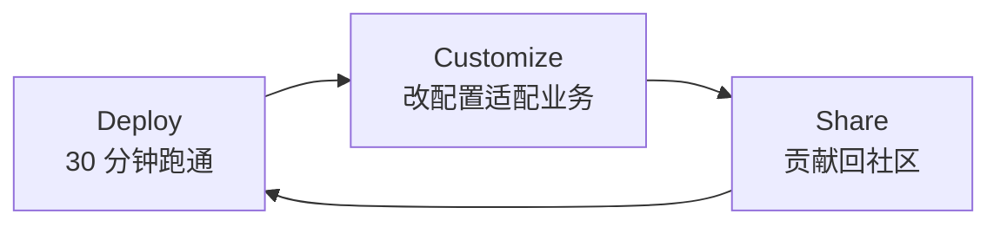

# Prax - Your Solo AI Forge

> **从"我听说过 Agent 能做什么"到"我 30 分钟内在公司场景里跑起了一个 Agent"。**

Prax 是一个面向**在职从业者**的**开源企业级 AI Agent 场景模板库**。

我们把典型业务场景（信息聚合、内容改写、竞品追踪、客户反馈分析等）抽象为**可 fork、可配置、可部署**的低代码工作流模板，让有产品思维但非开发者的从业者也能独立交付真正服务业务的 Agent。

Prax 的名字来自 **Praxis**（希腊语 πρᾶξις），意为"理论转化为行动的实践"。

---

## Why Prax

市场上的 AI Agent 生态分成两极：

| 开发者层 | 小白工具层 |
|---|---|
| 代码驱动，入门门槛高 | 无代码，但停留在玩具 demo |
| 适合写框架，不适合改业务 | 适合演示，不适合企业落地 |

中间层——"**有产品思维、企业场景、可复用、可配置**"的 Agent 模板库——几乎是空白。

Prax 填补这个空白。

## Who It's For

- **企业内产品经理 (PM)**: 需要可演示的 AI 落地 PoC（Proof of Concept, 概念验证）
- **运营 / 增长 / 业务分析师 (BA)**: 需要把重复信息处理交给 Agent
- **半技术背景开发者**: 需要从"写脚本"走向"系统化 Agent 交付"
- **独立顾问 / 自由职业者**: 需要给客户交付可复用的 AI 能力包

共同特征：**有产品认知、能读配置、不擅长从零构建工作流**。

## What You Get

在 Prax 上 fork 一个模板，你会拿到：

- 一个可导入 Dify / Coze 的 **workflow YAML**
- 一份 **场景化 YAML 配置**（数据源、推送渠道、风格约束）
- 一套 **LLM prompt 源码**（可直接粘贴到节点）
- 一份 **30 分钟部署指南**（前置条件 + 步骤 + troubleshoot）
- 一份 **样例输出**（告诉你 Agent 跑出来长什么样）

配置即定制：**改 YAML 不动结构**即可适配你的业务。

## Quick Start

### 最快路径（30 分钟跑通第一个 Agent）

```bash
git clone https://github.com/product-self-evolution/prax.git
cd prax

# 选一个你感兴趣的模板：
cd modules/ai-digest              # 信息聚合日报
# 或
cd modules/content-repurpose      # 内容多平台改写

# 按 docs/deployment.md 操作：
cat docs/deployment.md
```

详细步骤看每个模块自己的 README。

## Phase 1 Modules (v0.4.0+)

| 模块 | 业务场景 | 目标岗位 | 状态 |
|---|---|---|---|
| [`ai-digest`](modules/ai-digest/) | RSS 聚合 + AI 筛选摘要 + 邮件推送 | 情报岗 / PM / 行业分析 | MVP Skeleton |
| [`content-repurpose`](modules/content-repurpose/) | 单篇内容 → 多平台草稿（小红书/公众号/视频脚本） | 内容运营 / 独立创作者 | MVP Skeleton |
| [`workflow-starter`](modules/workflow-starter/) | 通用 Agent 骨架，供派生新模板 | 所有贡献者 | Stable |

## For Different Audiences

不同身份的读者，推荐以下入口：

| 你的身份 | 先读这个 |
|---|---|
| 🔍 **我是来看看 Prax 是什么** | 继续读本 README，看 [`docs/vision.md`](docs/vision.md) |
| 🧪 **我是来做首次部署测试的** | [`docs/testing/first-run-checklist.md`](docs/testing/first-run-checklist.md) |
| 🛠️ **我是来部署某个 Agent 到我公司** | 任一模板下的 `docs/deployment.md` |
| 📐 **我想贡献一个新模板** | [`CONTRIBUTING.md`](CONTRIBUTING.md) + [`docs/governance/module-quality-checklist.md`](docs/governance/module-quality-checklist.md) |
| 🏗️ **我想理解 Agentic 平台架构** | [`docs/agentic-platform-architecture-playbook.md`](docs/agentic-platform-architecture-playbook.md) |
| 🗺️ **我想看产品路线图** | [`docs/roadmap.md`](docs/roadmap.md) |

## Product Vision: The Next.js Starter of Enterprise Agents

我们的目标是成为 **"企业 AI Agent 的 Next.js Starter"**：

- 每个典型业务场景，都应该有一个官方 Prax 模板
- 开发者 fork 它作为起点，在自己的业务里长出差异化价值
- 社区贡献反哺官方市场，形成自增长生态



## Roadmap

### Phase 1 Deploy (Now, 0-8 weeks)

- 3 个 MVP 模板（ai-digest, content-repurpose, workflow-starter）
- Dify 主战场，每模板包含 workflow 骨架 + 配置样例 + 部署指南

### Phase 2 Customize (9-16 weeks)

- 多源（RSS + Newsletter + 网页抓取）
- 多渠道（邮件 / Slack / 飞书 / 企业微信）
- 场景预设（PM 版 / 运营版 / 分析师版）

### Phase 3 Share (17-24 weeks)

- 模板市场（可检索、分级、企业认证）
- 企业落地案例集
- 社区贡献者生态

完整路线图见 [docs/roadmap.md](docs/roadmap.md)。

## Design Principles

1. **场景优先**: 每个模板必须对应真实企业场景，不做玩具 demo
2. **低代码优先**: 首选可通过 Dify / Coze 部署，不强制写代码
3. **配置即定制**: 核心差异通过 YAML 控制，不需要改工作流结构
4. **可观测**: 模板自带输入输出样例与日志示范，方便企业审计
5. **可复用**: 每个模板必须能被 fork 并在 30 分钟内改造
6. **文档即产品**: README 与部署指南的质量就是产品本身的一部分

## Platform Strategy

- **主战场**: [Dify](https://dify.ai)（开源、自托管、workflow 可导出 YAML）
- **兼容**: [Coze Studio](https://github.com/coze-dev/coze-studio) 开源版、[n8n](https://n8n.io)
- **后端模型**: 支持 OpenAI / Anthropic / 自托管 Ollama

详见 [docs/vision.md](docs/vision.md) 第 9 节。

## Repository Structure

```text
prax/
  README.md                        # 你在这里
  LICENSE                          # MIT
  CONTRIBUTING.md
  CODE_OF_CONDUCT.md
  WORKFLOW.md                      # 独立项目发布流程
  docs/
    vision.md                      # 战略愿景与边界
    roadmap.md                     # 三阶段路线图
  modules/
    README.md
    ai-digest/                     # Agent 模板 1
    content-repurpose/             # Agent 模板 2
    workflow-starter/              # 通用骨架（供派生）
  templates/
    module-template.md             # 模板编写规范
  .github/
    ISSUE_TEMPLATE/
    pull_request_template.md
  scripts/
    release-prax.sh
    sync-prax-to-github.sh
```

## Contributing

Prax 正处于 Phase 1 早期，我们欢迎以下贡献：

- 新模板提案（场景 + 输入输出 + 30 分钟部署路径）
- 现有模板的可用性优化与 bug 修复
- 多平台兼容（Coze / n8n 版本的 workflow）
- 部署指南的清晰度提升

详见 [CONTRIBUTING.md](CONTRIBUTING.md)。

## License

MIT License. See [LICENSE](LICENSE).

你可以自由用于：

- 个人项目
- 商业项目
- 企业内部魔改
- 再分发（保留版权声明）

---

**Prax**: Turning theory into practice, one Agent at a time.
