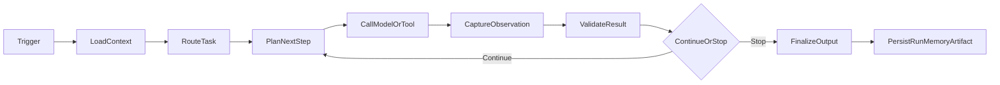
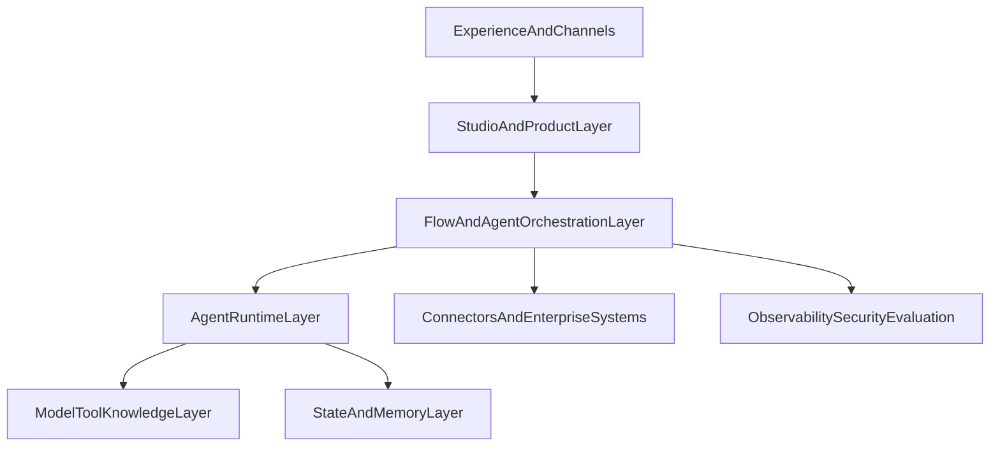
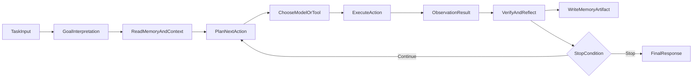
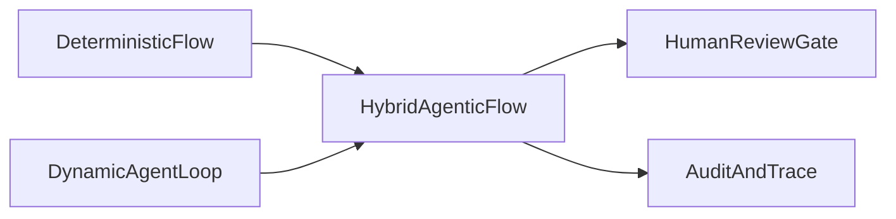
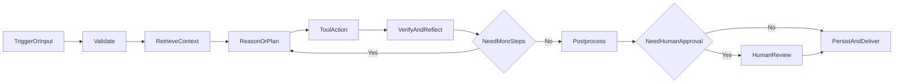
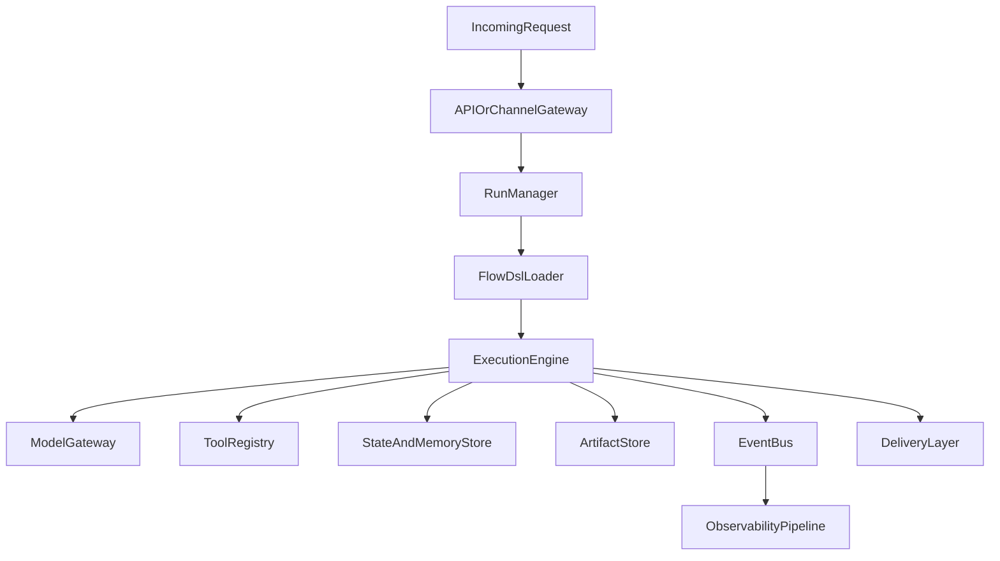
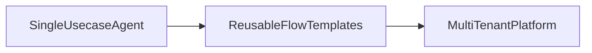
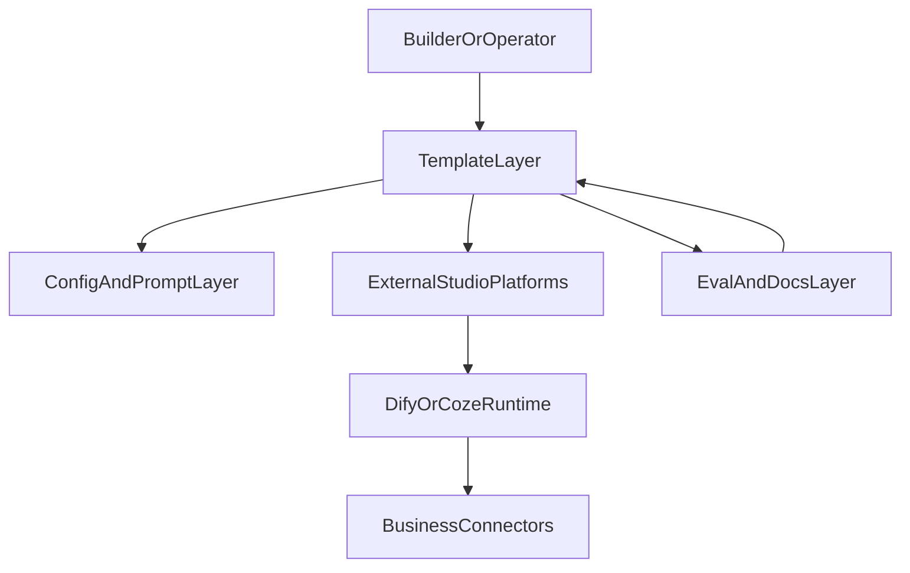

# Agentic 平台参考架构

> 目标：系统理解类 Coze / Dify 的 Agentic 平台是如何工作的，并把这套理解转化为可设计、可实现、可接入业务的 Agentic flow 与平台能力蓝图。

---

## 0. 先给结论

如果只记住 6 句话，这份文档最重要的结论是：

1. **Agentic 平台不是一个会聊天的壳，而是一个把目标、上下文、工具、状态、策略和治理组合起来的任务执行系统。**
2. **单个 Agent 的本质是一个受约束的决策循环**：理解目标 -> 计划下一步 -> 调用模型或工具 -> 校验结果 -> 更新状态 -> 决定继续还是结束。
3. **类 Coze / Dify 平台真正提供的不是“大模型能力”，而是“把大模型变成可配置、可调试、可上线能力”的平台化基础设施。**
4. **编排有两种核心形态**：静态工作流编排适合高确定性任务，动态 Agent 编排适合高不确定性任务，企业真正可落地的通常是二者混合的 Hybrid Agentic Flow（混合式 Agentic 流程）。
5. **平台化的关键不在“能跑通一个 Demo”，而在“能稳定重复地跑通一类业务任务”**，因此治理、评估、权限、版本、审计和人工介入与模型本身同等重要。
6. **从 0 到 1 的正确建设顺序通常不是先做平台，而是先做单场景 Agent，再抽象成可复用 Flow 模板，最后沉淀成平台能力。**

---

## 0.1 阅读对象与使用方式

这份文档面向两类读者：

- **产品经理（Product Manager，PM）**：希望建立对 Agentic 平台的完整产品认知，理解平台边界、核心模块、建设路线和落地风险。
- **懂一些技术的业务或技术读者**：希望理解平台的运行原理、参考架构、关键组件、实现逻辑和工程取舍。

建议的阅读方式如下：

1. 如果你是第一次接触 Agentic 平台，先看 `0`、`1`、`2`、`3`，建立整体框架。
2. 如果你正在设计产品或方案，重点看 `6`、`7`、`8`、`11`、`13`、`14`。
3. 如果你在做技术实现或架构评审，重点看 `3`、`4`、`5`、`9`、`10`、`12`、`15`。

### 0.2 文档定位

本文不是某个平台的产品说明书，也不是某个框架的开发教程，而是一份偏通用、偏标准化的参考白皮书。

它试图回答 4 个问题：

1. Agentic 平台到底是什么，它与传统工作流、聊天机器人和 AI 应用有何区别。
2. Agent 为什么能运行起来，它的决策循环和编排机制是什么。
3. 一个可上线的 Agentic 平台应该具备哪些参考架构与工程能力。
4. 团队应该如何从单场景 Agent 演进到可复用的 Flow 与平台层能力。

### 0.3 术语表（Glossary）

| 术语 | 标准化解释 |
|---|---|
| Agent | 在目标、上下文、能力和约束条件下，能够多步决策并执行任务的软件实体 |
| Agentic Platform | 用于构建、编排、运行、观测和治理 Agent 的产品与技术系统 |
| Agentic Flow | 同时包含确定性工作流和动态 Agent 决策节点的任务流程 |
| Workflow | 由预定义节点、边和规则组成的确定性执行流程 |
| Runtime（运行时） | 负责执行 Flow / Agent、维护状态、处理异常和调度资源的系统层 |
| Tool | 被平台统一封装后，可供 Agent 调用的外部能力，如 API、数据库、脚本、浏览器动作 |
| Memory（记忆） | 会影响后续执行决策的可写历史状态，如用户偏好、摘要和长期规则 |
| Knowledge（知识） | 相对稳定、以检索为主的事实和文档集合，如知识库、制度、产品资料 |
| Context（上下文） | 当前任务执行所需的即时信息，如本次输入、当前变量、临时结果 |
| Run | 一次完整执行实例，从触发开始到结束 |
| Step | Run 内部的单个执行步骤，通常对应一个节点或动作 |
| Artifact | 执行过程中产出的结果对象，如报告、JSON、截图、消息、文件 |
| Guardrail（护栏） | 用于约束模型和工具行为的安全、权限、格式或业务规则 |
| Human-in-the-Loop | 把人工确认、审批、补数或纠偏嵌入 Agent 流程的机制 |
| Evaluation（评估） | 对 Agent 输出质量、稳定性、成本和通过率进行度量与比较的方法 |
| Connector | 平台与外部系统之间的接入适配层，如 CRM、ERP、IM、邮件、数据仓库连接器 |

### 0.4 标准化定义（建议在团队内统一）

为了避免团队内部对“Agent”“Workflow”“Copilot”“Bot”等概念混用，建议在产品与技术文档中统一采用下面的定义：

| 概念 | 建议定义 | 不建议混用为 |
|---|---|---|
| Agent | 能在多步循环中自主决定下一步动作的执行单元 | 任意一次模型调用 |
| Workflow | 预定义路径的流程编排结构 | 所有 AI 任务的统称 |
| Copilot | 嵌入某一业务界面、主要辅助人完成任务的 Agent 形态 | 独立自治系统 |
| Bot | 面向聊天或消息通道的交互外壳 | 平台本身 |
| Template | 可复用的 Flow、Prompt、配置和接入约定组合包 | 运行时实例 |
| Platform Capability | 被多个 Agent / Flow 共享的底层能力，如 Runtime、Registry、Eval | 单个业务模板 |

如果团队不先统一这些定义，后续在需求评审、架构评审和版本规划中会持续出现“同词不同义”的沟通噪音。

---

## 1. 什么是 Agentic 平台

### 1.1 定义

Agentic 平台是一类用于**构建、编排、运行、观测和治理 AI Agent** 的产品系统。

它通常提供以下能力：

- 让用户以可视化或配置化方式定义任务流程
- 让 Agent 在运行时调用模型、知识、工具和外部系统
- 让系统保存任务上下文、执行状态、长期记忆和运行日志
- 让团队能够发布、复用、调试、评估和审计 Agent

换句话说，Agentic 平台解决的不是“如何调用一次大模型”，而是“如何让大模型持续、稳定、可控地完成一类业务任务”。

### 1.2 它和什么不同

| 形态 | 核心目标 | 优势 | 局限 | 适用场景 |
|---|---|---|---|---|
| Chatbot（聊天机器人） | 回答问题、对话交互 | 上手快 | 可控性弱，流程能力有限 | 问答、轻助手 |
| Workflow Engine（工作流引擎） | 按固定路径执行节点 | 稳定、可预测、易审计 | 面对不确定任务时僵硬 | 审批、固定流程自动化 |
| RPA（Robotic Process Automation，机器人流程自动化） | 模拟人工操作系统 | 对旧系统友好 | 脆弱、难泛化 | 规则稳定的桌面/网页操作 |
| AI Application（普通 AI 应用） | 面向某单一场景封装模型能力 | 体验聚焦 | 扩展性有限 | 单点 Copilot、生成工具 |
| Agentic Platform | 让 AI 任务具备决策、工具调用、状态管理和治理能力 | 可复用、可扩展、可平台化 | 复杂度更高 | 多场景 Agent、企业 AI 平台 |

### 1.3 Coze / Dify 这类平台本质在做什么

从产品本质上看，Coze / Dify 这一类平台通常都在做 6 件事：

1. **任务建模**：把业务任务表达为 Chatflow、Workflow、Agent 或 Multi-Agent。
2. **能力接入**：连接模型、知识库、插件、外部 API（Application Programming Interface，应用程序编程接口）和系统动作。
3. **运行调度**：在运行时决定先做什么、调用什么、何时终止、如何重试。
4. **状态管理**：维护 Session（会话）、Memory（记忆）、Artifact（产物）和 Run（执行记录）。
5. **治理与评估**：做日志、成本、质量、安全、权限和版本管理。
6. **分发与集成**：把 Agent 接入 Web、企业 IM（Instant Messaging，即时通讯）、API、定时任务或业务系统。

因此，你可以把这类平台理解为：

> 一个面向 AI 任务的“低代码产品层 + 运行时层 + 集成治理层”组合体。

---

## 2. Agentic 平台为什么能工作

### 2.1 最小工作原理

一个 Agent 之所以能“像人在工作”，不是因为它真的理解世界，而是因为平台为它提供了 5 类必要条件：

1. **目标**：知道这次要完成什么任务。
2. **上下文**：知道可参考哪些历史、知识、输入和约束。
3. **能力**：知道自己能调用哪些模型和工具。
4. **循环**：知道每一步做完后如何判断下一步。
5. **边界**：知道什么情况下应该停止、升级人工、拒绝或回退。

少了其中任何一个，Agent 都容易退化成“只会输出一段像样文本的大模型调用”。

### 2.2 一次任务执行的全链路



这条链路里，真正重要的不是某一步单点能力，而是：

- 任务状态是否持续可见
- 上下文是否在关键节点被正确读取
- 工具调用是否可校验、可重试、可审计
- 模型输出是否被结构化约束
- 平台是否知道何时结束，何时需要人工接管

### 2.3 Agent 和 Workflow 的根本差别

可以用一句话区分：

- **Workflow** 适合“我已经知道标准路径是什么”
- **Agent** 适合“我只知道目标，但中间步骤需要动态决定”

更具体一点：

| 维度 | Workflow | Agent |
|---|---|---|
| 路径 | 预定义 | 动态决定 |
| 控制方式 | 平台显式控制 | 运行时策略控制 |
| 可预测性 | 高 | 中 |
| 灵活性 | 中 | 高 |
| 调试成本 | 低 | 高 |
| 企业治理友好度 | 高 | 中，需要额外约束 |

现实里最有价值的系统不是二选一，而是：

> 用 Workflow 管住大框架，用 Agent 解决不确定的局部决策。

---

## 3. Agentic 平台的分层架构

### 3.1 总体分层



### 3.2 各层职责

| 层级 | 核心职责 | 典型组件 | 平台价值 |
|---|---|---|---|
| 体验层（Experience and Channels） | 用户触达、交互和触发 | Web、Bot、API、企业 IM、定时任务入口 | 让 Agent 能进入真实工作场景 |
| 产品层（Studio and Product Layer） | 让人能配置、调试、发布和复用 Agent | Studio、模板、Prompt 管理、版本管理 | 让非纯开发者也能构建 Agent |
| 编排层（Flow and Agent Orchestration） | 定义节点、边、状态迁移和子任务关系 | Workflow Canvas、Router、Subflow、Human Gate | 把任务表达成系统可执行结构 |
| 运行时层（Agent Runtime） | 执行 Agent 循环、维护步骤级状态 | Planner、Executor、Critic、Policy Engine | 让 Agent 在运行中做决策 |
| 能力层（Model Tool Knowledge） | 提供模型、工具、知识和执行动作 | LLM、Embedding、RAG、Plugin、Code Executor | 给 Agent 可用能力 |
| 状态层（State and Memory） | 保存会话、记忆、产物、缓存、运行上下文 | Session Store、Vector Store、Artifact Store | 让任务可持续、可追踪、可复用 |
| 集成层（Connectors and Enterprise Systems） | 对接业务系统与外部世界 | CRM、ERP、Email、Feishu、Slack、DB | 让 Agent 融入真实业务流 |
| 治理层（Observability, Security, Evaluation） | 监控、权限、合规、评估、审计、成本管理 | Logs、Trace、Guardrail、RBAC、Eval | 让 Agent 能上线而不是只能演示 |

### 3.3 平台设计的真正难点

类 Coze / Dify 平台看上去最显眼的是“画布”和“节点”，但平台的真正难点通常在 4 个地方：

1. **运行时状态一致性**：多轮工具调用后，系统如何知道当前任务进行到哪里。
2. **能力抽象一致性**：模型、知识、插件、数据库、代码执行器是否能被统一接入。
3. **治理闭环**：谁能发布、谁能调用、调用了什么、出了问题怎么回放。
4. **产品可用性**：是否能让非框架工程师通过模板和配置完成场景交付。

很多平台能做出 Demo，难的是做成“企业内部可重复使用的生产系统”。

### 3.4 参考架构原则

下面这些原则更像白皮书层面的“参考架构原则”，适合在团队内作为设计评审基线：

1. **目标先于能力**：先定义业务目标、成功标准和任务边界，再决定模型、工具和编排方式。
2. **状态必须显式化**：Run、Step、Artifact、Memory 不应只存在于 Prompt 或日志文本中，而应作为平台一级对象。
3. **动态与静态分层**：确定性流程优先显式建模，不确定性局部再交给 Agent 决策。
4. **工具必须协议化**：工具接入不应依赖隐式 Prompt 描述，而要有清晰的输入、输出、鉴权和错误语义。
5. **上下文分层治理**：Context、Memory、Knowledge 需要不同的读写策略、生命周期和成本策略。
6. **人工介入默认可插入**：高风险节点必须支持人工确认、补数和回退，而不是把人工接管视为异常情况。
7. **评估优先于优化**：在没有标准样本集和质量指标前，不应盲目迭代 Prompt、模型或多 Agent 结构。
8. **治理能力默认开启**：权限、审计、密钥管理和成本追踪不应在上线后再补。
9. **平台能力优先复用**：能沉淀为共享能力的，就不要重复埋在单一模板里。
10. **渐进式平台化**：先做单场景价值闭环，再做模板化，再做平台中台，避免过早抽象。

这些原则的意义在于，它们能够帮助团队在“产品可用性”和“技术可治理性”之间建立平衡，而不是只追求 Agent 的表面智能感。

---

## 4. Agent Runtime 是如何运行的

### 4.1 Agent 的内部角色拆解

一个成熟的 Agent Runtime（运行时）通常至少包含以下角色：

| 角色 | 作用 | 是否总是显式存在 |
|---|---|---|
| Planner | 根据目标和上下文生成下一步计划 | 不一定，简单流可省略 |
| Router | 决定走哪条路径、调用哪个子能力 | 常见 |
| Executor | 实际执行模型调用、工具调用、子流程调用 | 必需 |
| Critic / Verifier | 检查输出质量、结构和风险 | 企业场景强烈建议有 |
| Memory Manager | 决定读哪些记忆、写哪些记忆 | 长任务或多轮任务必需 |
| Tool Adapter | 把外部工具封装成统一调用协议 | 必需 |
| Policy Engine | 处理权限、预算、风险、模型选择等策略 | 平台化后必需 |
| Session Manager | 保存当前 Run、Step、Artifact 和上下文状态 | 必需 |

### 4.2 一次 Agent Run 的循环



### 4.3 Stop Condition（终止条件）为什么关键

很多 Agent 失败，不是因为“不会思考”，而是因为“不知道什么时候该停”。

一个成熟的平台至少需要支持 5 类终止条件：

1. **任务成功完成**：得到了满足结构要求的结果。
2. **达到最大步数**：防止无限循环。
3. **达到预算上限**：限制 Token（模型文本计量单位）、时间或费用。
4. **命中风险规则**：例如触发敏感工具、越权访问、输出高风险内容。
5. **需要人工判断**：例如审批、确认、补数、模糊目标澄清。

### 4.4 Agent Runtime 的伪代码逻辑

下面这段不是具体代码，而是平台级实现思路：

```text
initialize run
load task, policy, session, memory

while run.not_terminated:
  build current_context
  next_action = planner_or_router(current_context)

  if next_action.type == tool:
    tool_result = execute_tool(next_action)
    append_observation(tool_result)

  if next_action.type == model:
    model_result = call_model(next_action, current_context)
    append_observation(model_result)

  verify_step_result()
  write_step_state()

  if hit_stop_condition():
    finalize_run()
    break
```

真正的平台实现会在这个基础上继续补充：

- 异常处理
- 幂等执行
- 状态持久化
- 子任务拆分
- 并发执行
- 回放与断点恢复

### 4.5 为什么说 Agent 是“受约束的决策循环”

Agent 不是自由思考实体，而是被 4 层约束包住的循环：

1. **任务约束**：目标、输入、输出格式、成功标准。
2. **平台约束**：步数、预算、节点类型、工具白名单。
3. **安全约束**：权限、数据边界、敏感操作确认。
4. **业务约束**：行业规则、审批机制、服务等级协议。

没有这些约束，Agent 只会更“聪明地失控”。

---

## 5. Agent 编排范式

### 5.1 你需要掌握的 5 种主流范式

| 范式 | 机制 | 优点 | 风险 | 适用场景 |
|---|---|---|---|---|
| Deterministic Workflow（确定性工作流） | 固定节点和边 | 最稳定、最好审计 | 弹性弱 | 表单处理、审批、固定 ETL（Extract, Transform, Load，抽取转换加载） |
| ReAct | 推理与行动交替 | 适应开放任务 | 易绕圈，调试难 | 搜索、资料收集、工具探索 |
| Plan-and-Execute | 先规划后执行 | 结构清晰，适合复杂任务 | 计划可能过度理想化 | 多步研究、内容生产、方案生成 |
| Supervisor | 主 Agent 调度多个子 Agent | 易分工、可扩展 | 协调成本高 | 多专业角色协作 |
| Graph-based Agent | 在图状态机中动态跳转 | 可混合静态与动态优势 | 实现复杂 | 企业级长流程、多状态任务 |

### 5.2 最推荐的企业落地方式：Hybrid Agentic Flow



Hybrid Agentic Flow 的核心思想是：

- 用静态 Flow 保证主流程稳定
- 在高不确定节点中嵌入动态 Agent 循环
- 在高风险节点放人工 Gate（关卡）
- 用日志、版本和评估把整个链路治理起来

这基本就是类 Coze / Dify 平台最适合企业落地的方式。

### 5.3 什么时候用静态，什么时候用动态

一个简单判断方法：

| 问题 | 倾向 |
|---|---|
| 我能否预先画出 80% 以上的标准路径？ | 能，则优先 Workflow |
| 中间步骤是否必须根据实时信息决定？ | 是，则引入 Agent |
| 任务是否涉及高风险外部动作？ | 是，则加人工确认 |
| 是否需要多人/多角色分工？ | 是，则考虑 Supervisor 或 Subflow |
| 是否必须严格审计每一步？ | 是，则优先显式节点和结构化状态 |

### 5.4 多 Agent 不是默认更高级

很多平台一开始就想做 Multi-Agent（多 Agent），但实际项目里最常见的问题是：

- 职责切分不清
- 子 Agent 边界模糊
- 上下文重复传递导致成本暴涨
- 协调链太长，结果反而更慢
- 错误排查困难

因此实践上更建议：

1. 先做单 Agent + 工具
2. 再做单 Agent + 子流程
3. 最后才考虑 Supervisor + 多 Agent

---

## 6. Flow 编排到底在编排什么

### 6.1 Flow 的 6 个基本元素

设计一个 Agentic Flow，本质上是在设计下面 6 样东西：

1. **Trigger（触发器）**：谁在什么条件下启动任务
2. **State（状态）**：当前任务进行到哪里
3. **Node（节点）**：每一步做什么
4. **Edge（边）**：什么条件下流向下一步
5. **Context（上下文）**：每一步能读到哪些信息
6. **Artifact（产物）**：每一步产出什么可复用结果

### 6.2 典型节点类型

| 节点类型 | 作用 | 常见用途 |
|---|---|---|
| Input | 接收用户输入、事件或外部数据 | 表单、Webhook（Web 回调）、定时任务 |
| Validate | 校验输入完整性和合法性 | 防注入、字段校验、预检查 |
| Retrieve | 检索知识、记录或历史上下文 | RAG、检索数据库、查 CRM |
| Reason | 让模型进行判断、总结、生成、决策 | 分类、抽取、规划、写作 |
| Tool | 调用外部系统或代码能力 | 发消息、写数据库、抓网页 |
| Branch / Router | 分支和路由 | 场景分流、模型分流、流程跳转 |
| Human Gate | 人工确认和审批 | 合同、财务、人事、发布 |
| Postprocess | 结构化、裁剪、格式转换 | JSON 清洗、模板化输出 |
| Persist | 写入状态、记忆、日志、产物 | 长任务、追踪、复用 |

### 6.3 企业级 Flow 需要额外考虑的 8 个机制

| 机制 | 为什么重要 |
|---|---|
| Timeout（超时） | 防止节点挂死 |
| Retry（重试） | 处理网络和外部接口波动 |
| Idempotency（幂等） | 防止重复写入、重复通知、重复扣费 |
| Compensation（补偿） | 失败后回滚或纠偏 |
| Checkpoint（检查点） | 便于断点恢复 |
| Escalation（升级） | 异常时转人工或转专家流程 |
| Rate Limit（限流） | 保护系统和成本 |
| Audit（审计） | 满足企业治理和问题回放 |

### 6.4 一个通用的 Agentic Flow 骨架

这个骨架可以视为对常见三段式方法的进一步展开：它保留了输入校验、核心推理和输出后处理的主干，同时把上下文检索、工具动作、验证反思和人工关卡显式化。



这个骨架能够覆盖：

- 简单生成型任务
- 检索增强型任务
- 工具链任务
- 人机协同任务
- 长任务的阶段式执行

---

## 7. 如何从业务任务拆出 Agentic Flow

### 7.1 常见错误

很多团队做 Flow 时，会直接从“节点库里有什么”开始拼图，这是错误的。

正确起点应该是业务任务，而不是平台节点。

最常见的 5 个错误：

1. 从模型能力出发，而不是从业务目标出发
2. 一上来就做大而全的多 Agent
3. 没有定义输入、输出和成功标准
4. 忽略失败路径和人工接管
5. 没有区分“必须自动化”和“适合保留人工判断”的部分

### 7.2 正确拆解方法

可以按下面 8 步走：

1. **定义业务结果**
   - 最终交付物是什么
   - 谁来消费它
   - 什么叫成功

2. **找出关键阶段**
   - 输入采集
   - 理解与判断
   - 动作执行
   - 结果交付
   - 反馈回流

3. **区分确定性与不确定性**
   - 确定性的部分用 Workflow 固化
   - 不确定性的部分交给 Agent 或模型判断

4. **定义节点输入输出**
   - 每个节点吃什么
   - 吐什么
   - 是否要求结构化

5. **设计上下文策略**
   - 哪些上下文是运行时必需的
   - 哪些是可选补充
   - 哪些要做摘要、裁剪、索引

6. **定义失败与兜底**
   - 哪些错误可重试
   - 哪些错误要转人工
   - 哪些情况应该停止而不是继续猜

7. **设计治理边界**
   - 谁能发布
   - 谁能调用生产环境工具
   - 哪些动作必须审批

8. **定义验证指标**
   - 质量是否变好
   - 时间是否缩短
   - 成本是否可控
   - 人工干预是否下降

### 7.3 一个简洁模板

你可以把任何 Agentic Flow 先写成下面这张表，再决定是否进入平台实现：

| 维度 | 需要回答的问题 |
|---|---|
| Business Goal | 这条 Flow 最终替谁解决什么问题 |
| Trigger | 谁触发，何时触发 |
| Input | 输入是什么，结构是否稳定 |
| Core Decisions | 哪些步骤需要动态决策 |
| Tools | 需要调用哪些系统和动作 |
| Knowledge | 需要连接哪些知识或历史记录 |
| Human Gate | 哪一步必须人工审核 |
| Output | 输出的格式、渠道和消费对象是什么 |
| Failure Path | 失败时重试、回滚还是转人工 |
| Metrics | 如何判断这条 Flow 有价值 |

---

## 8. 平台能力设计：做一个“能用”的 Agentic 平台需要什么

### 8.1 面向用户的核心模块

| 模块 | 用户价值 | 为什么必要 |
|---|---|---|
| Agent Studio | 创建、调试、编排 Agent | 平台入口 |
| Prompt 管理 | 管理系统提示词、版本和变量 | 降低调试混乱 |
| Tool Center | 注册、测试、授权工具 | 把能力接成平台资产 |
| Knowledge Hub | 管理知识库、检索配置和索引策略 | 支持 RAG |
| Template Market | 复用行业模板和最佳实践 | 提高平台扩散效率 |
| Debug Sandbox | 单步调试、回放、对比模型输出 | 降低调试成本 |
| Publish Center | 版本发布、灰度、回滚 | 让能力可上线 |
| Eval Center | 做离线评估、线上评分和回归测试 | 防止质量退化 |
| Channel Connectors | 接入 Web、API、Slack、飞书等 | 接入业务工作流 |
| Admin Console | 权限、租户、配额、审计 | 企业交付必需 |

### 8.2 面向不同角色的平台视图

| 角色 | 重点能力 |
|---|---|
| 产品经理（Product Manager，PM） | 模板、画布、Prompt 调试、效果评估 |
| 运营 | 渠道接入、内容质量、排期与批量执行 |
| 实施 / 解决方案 | 工具对接、租户配置、权限、发布 |
| 开发者 | Tool SDK（Software Development Kit，软件开发工具包）、运行日志、接口扩展 |
| 企业管理员 | 安全、审计、预算、组织权限 |

### 8.3 平台产品设计的 4 条关键原则

1. **配置即定制**：尽量让场景差异通过配置而不是改引擎实现。
2. **模板即产品**：模板质量直接决定平台 adoption（采纳率）。
3. **运行时可见**：每一步状态、输入、输出和成本都应该可追踪。
4. **治理默认开启**：不要等到生产事故后再补权限和审计。

---

## 9. 实现逻辑与技术架构

### 9.1 平台后端的关键组件

| 组件 | 核心职责 | 设计要点 |
|---|---|---|
| Workflow DSL（Domain Specific Language，领域特定语言） | 定义 Flow 的结构、节点、边、变量和策略 | 需要可序列化、可版本化、可校验 |
| Execution Engine | 执行 Workflow 与 Agent 节点 | 需要状态机、重试、超时、恢复能力 |
| Agent Runtime | 执行动态决策循环 | 需要 Planner、Tool Call、Verification |
| Model Gateway | 统一接入模型供应商 | 支持路由、Fallback（降级切换）、配额和成本统计 |
| Tool Registry | 管理工具定义、鉴权和调用协议 | 把异构能力统一为平台可调度接口 |
| Context Store | 存储上下文和运行时变量 | 区分短期状态与长期记忆 |
| Memory Store | 保存用户偏好、历史摘要、长期知识 | 需要生命周期管理 |
| Artifact Store | 保存输出文件、报告、截图、结构化结果 | 支持追溯和复用 |
| Scheduler | 定时执行和异步任务编排 | 适合批量 Agent 场景 |
| Event Bus | 分发执行事件和状态变化 | 解耦监控、通知和子系统联动 |
| Observability Pipeline | 采集日志、Trace（链路追踪）和指标 | 便于排障和优化 |
| Policy / Guardrail Service | 安全策略、敏感动作确认、预算控制 | 企业上线关键组件 |

### 9.2 可视化画布和运行时之间的映射关系

平台里“画布”和“运行时”不能是两套语言，它们本质上应该映射到同一个中间表示。

典型关系如下：

| 画布元素 | 中间表示 | 运行时行为 |
|---|---|---|
| 节点 | Node Definition | 执行一个步骤 |
| 连线 | Transition Rule | 决定下一步流向 |
| 变量 | Context Schema | 注入当前上下文 |
| 工具节点 | Tool Call Spec | 调用注册工具 |
| 模型节点 | Model Invocation Spec | 调用模型网关 |
| 条件分支 | Predicate Rule | 执行路由逻辑 |
| 子流程 | Subflow Ref | 进入嵌套执行 |
| 人工审批 | Human Task | 暂停并等待人工输入 |

换句话说：

> 画布是给人看的，DSL 是给系统存的，运行时是给机器执行的。

### 9.3 建议的数据模型

一个最小但够用的平台实体模型通常包括：

| 实体 | 说明 |
|---|---|
| Agent | 一个可发布、可调用的 Agent 定义 |
| Flow | 一个流程定义，可以是 Agent 的执行骨架 |
| Node | 流程中的步骤定义 |
| Edge | 节点之间的转移规则 |
| Run | 一次完整执行实例 |
| Step | Run 内部的单步记录 |
| ToolCall | 一次工具调用明细 |
| MemoryItem | 一条记忆，可能属于用户、Agent 或租户 |
| Artifact | 一次执行产出的文件或结构化结果 |
| Evaluation | 一次质量评估或回归结果 |
| Connector | 一个外部系统连接配置 |
| Policy | 一组运行规则、权限和预算限制 |
| PromptVersion | 某个 Prompt 的版本记录 |

### 9.4 运行时数据流



### 9.5 关键工程问题

#### 1. 状态持久化

如果 Flow 很长、包含人工审批或异步任务，必须把 Run 状态持久化，否则一旦进程中断，整条任务会丢失。

#### 2. 幂等设计

Agent 调用外部系统时，重复执行的副作用非常大，例如：

- 重复发消息
- 重复创建工单
- 重复入库
- 重复触发扣费动作

因此每个副作用节点都应该设计幂等 Key（唯一键）或去重策略。

#### 3. 模型不可预测性治理

模型输出并不天然稳定，因此工程上要做：

- 结构化输出约束
- 模板化提示词
- 多模型回退策略
- 关键步骤的验证器
- 人工复核入口

#### 4. 成本控制

平台要能回答这些问题：

- 哪个 Agent 最贵
- 哪个步骤最费 Token
- 哪个租户成本超预算
- 哪个模型可被更便宜模型替代

如果做不到，平台在企业里很难长期运营。

---

## 10. Memory、Knowledge 和 Context 的区别

这三者在很多平台里经常被混用，但如果概念不分清，设计很容易混乱。

| 概念 | 定义 | 时间尺度 | 典型例子 |
|---|---|---|---|
| Context（上下文） | 当前任务执行时需要临时读到的信息 | 秒到小时 | 当前用户输入、本次订单、当前流程变量 |
| Memory（记忆） | 会影响后续任务的历史状态和偏好 | 天到月 | 用户偏好、历史摘要、长期规则 |
| Knowledge（知识） | 相对稳定的事实、文档和制度 | 月到年 | 产品文档、知识库、操作手册 |

一个成熟的平台会对三者做不同策略：

- Context 要快，常在 Session 或缓存里
- Memory 要可写、可摘要、可淘汰
- Knowledge 要可索引、可版本化、可检索

---

## 11. Agent 如何融入平台或其他工作场景

### 11.1 4 类典型接入模式

| 模式 | 典型形态 | 适合什么 |
|---|---|---|
| 前台助手 | 嵌入 Web 或聊天界面，和用户实时交互 | 问答、咨询、表单辅助 |
| 后台 Copilot | 嵌入业务系统页面，辅助人完成任务 | CRM 助手、客服建议、内容助手 |
| 异步批处理 Agent | 定时触发、事件触发，无需用户在线 | 日报、监控、报告、批量审核 |
| 人机协同审批流 | Agent 先处理，人类最后确认 | 合同、招聘、财务、法务 |

### 11.2 接入到常见企业场景的方式

| 场景 | Agent 的典型职责 | 平台需要的能力 |
|---|---|---|
| SaaS 产品 | 为终端用户提供智能操作和建议 | 多租户、嵌入式 SDK、权限隔离 |
| 企业 IM | 接收指令、推送结果、触发审批 | Bot、消息卡片、会话上下文 |
| CRM | 做客户摘要、跟进建议、自动记录 | 数据读取、写回、审计 |
| BI | 拉数、解释数据、生成周报 | 数据工具、模板化图表输出 |
| 内容工作流 | 选题、改写、审核、分发 | 模板、多渠道、人工审校 |
| 客服流程 | 分类、知识检索、回复建议、工单升级 | RAG、情绪识别、人工接管 |

### 11.3 平台融入业务，不是“外挂一个聊天窗”

业务接入的本质不是“加个 AI 按钮”，而是把 Agent 嵌进以下任一环节：

1. **输入前**：帮助采集和标准化信息
2. **处理中**：帮助判断、生成、检索和操作
3. **输出后**：帮助分发、记录、归档和学习
4. **反馈时**：把用户纠错、点击和审批结果回流成记忆或评估数据

只有进入这四个环节之一，Agent 才真正融入了工作流，而不是一个孤立玩具。

### 11.4 轻量案例：把抽象架构落到具体场景

下面 3 个案例不是产品 PRD（Product Requirements Document，产品需求文档），而是帮助理解平台能力如何落地的参考切片。

#### 案例 A：销售跟进 Copilot

**场景**：销售在 CRM（Customer Relationship Management，客户关系管理）里查看客户记录时，需要系统自动生成跟进摘要与下一步建议。

**对应平台能力**：

- 体验层：嵌入 CRM 页面侧边栏
- 编排层：`RetrieveCustomerData -> Summarize -> SuggestNextAction -> HumanConfirm -> WriteBackCRM`
- 能力层：CRM 读取工具、知识库检索、LLM 总结能力
- 治理层：写回 CRM 前强制人工确认

**为什么适合做 Copilot 而不是全自动 Agent**：

- 最终动作具有业务风险
- 销售人员仍需要保留判断权
- 推荐质量可以通过人工反馈逐步优化

#### 案例 B：异步行业情报 Agent

**场景**：产品或战略团队每天早上收到一份自动生成的行业动态摘要。

**对应平台能力**：

- 触发器：定时任务
- 编排层：`Fetch -> Parse -> Filter -> Summarize -> Deliver`
- 状态层：保存抓取窗口、摘要历史、订阅偏好
- 治理层：成本控制、失败重试、发送日志

**为什么适合 Workflow + 局部 Agent 的混合模式**：

- 抓取、分发、失败重试是确定性的
- 摘要、评分、主题归类是非确定性的

#### 案例 C：客服工单分流与升级

**场景**：平台收到客服工单后，需要自动分类、检索知识、生成回复建议，并在高风险场景下升级人工。

**对应平台能力**：

- 编排层：`Classify -> RetrieveKnowledge -> DraftReply -> RiskCheck -> HumanEscalation`
- 能力层：分类模型、知识检索、客服系统连接器
- 治理层：敏感话术过滤、情绪风险识别、升级审计

**为什么它是典型的 Agentic Flow**：

- 不是纯问答，因为包含业务动作和升级逻辑
- 不是纯工作流，因为分类、检索和回复生成依赖模型判断
- 需要把 AI 输出放在企业治理框架下运行

---

## 12. 治理、评估与上线逻辑

### 12.1 为什么治理在 Agent 平台里是一级模块

企业不怕 AI 不够聪明，企业更怕：

- 越权访问
- 错误操作外部系统
- 结果不可追溯
- 质量回退无人发现
- 成本不透明

因此治理不是后置补丁，而是平台一级能力。

### 12.2 必须具备的治理清单

| 能力 | 作用 |
|---|---|
| RBAC（Role-Based Access Control，基于角色的访问控制） | 控制谁能看、改、发、调生产工具 |
| Secret 管理 | 安全管理 API Key、数据库连接等密钥 |
| 审计日志 | 追踪谁在何时发布、执行和修改了什么 |
| 成本看板 | 跟踪模型成本、工具成本、租户成本 |
| 评估回归 | 在 Prompt 或 Flow 变更后检查是否退化 |
| 安全策略 | 敏感操作确认、内容过滤、越权拦截 |
| 灰度发布 | 控制新版本的试运行范围 |
| 回放能力 | 复现一次失败运行的完整上下文 |

### 12.3 一个现实判断标准

如果一个平台无法回答下面问题，就还没有准备好做企业级 Agent：

- 某次错误结果是哪个版本引起的？
- 这次执行调用了哪些外部系统？
- 用户数据有没有被发到不允许的模型上？
- 新版 Prompt 是否导致通过率下降？
- 为什么这个 Agent 今天成本突然上升？

---

## 13. 非功能性要求（Non-Functional Requirements, NFR）

### 13.1 为什么 Agentic 平台尤其需要 NFR

传统软件系统重视非功能性要求，Agentic 平台更需要，因为它同时具备以下三种复杂性：

1. **模型不稳定性**：输出不是完全确定的，质量和成本会随模型、Prompt 和上下文波动。
2. **流程不确定性**：Agent 可能多步迭代、动态分支、跨工具调用。
3. **业务副作用**：平台常常会连接真实业务系统，产生通知、写库、升级、审批等后果。

因此，Agentic 平台的 NFR 不只是“系统要快、要稳”，而是要回答：

- 快到什么程度才不影响用户决策
- 稳到什么程度才足以支撑业务流程
- 可控到什么程度才敢接外部系统
- 可观测到什么程度才便于排障、审计和优化

### 13.2 参考 NFR 维度

| 维度 | 核心问题 | 平台级要求示例 |
|---|---|---|
| Performance（性能） | 响应是否足够快 | 在线交互型 Agent 首次响应可感知延迟应被严格控制，长任务需提供进度反馈 |
| Availability（可用性） | 服务是否可持续使用 | 核心运行链路、工具调用网关、状态存储应有明确可用性目标 |
| Reliability（可靠性） | 输出和执行是否稳定 | 相同输入下结果波动应被控制在可接受范围，关键动作需可验证 |
| Scalability（可扩展性） | 流量上升时是否能扩容 | 任务执行、模型调用、连接器和检索层应支持横向扩展 |
| Security（安全性） | 是否存在越权、泄露、滥用 | 密钥管理、权限边界、模型路由限制、敏感动作确认必须显式存在 |
| Privacy（隐私） | 用户和企业数据是否被妥善处理 | 数据分类分级、最小必要访问、脱敏与保留期限策略应明确 |
| Observability（可观测性） | 问题是否可发现、可回放 | Run、Step、ToolCall、成本、失败原因应可追踪 |
| Maintainability（可维护性） | 平台是否容易迭代和排障 | Flow、Prompt、Connector、Policy 都应具备版本化和回滚能力 |
| Interoperability（互操作性） | 是否容易接入其他系统 | 节点协议、连接器协议、事件协议与导入导出格式应尽量标准化 |
| Compliance（合规性） | 是否满足行业和组织规则 | 审计、数据边界、内容风控、人工审批要求应可配置 |

### 13.3 建议的 NFR 基线

下面不是强制标准，而是一组适合多数团队作为架构评审起点的参考基线：

| 类别 | 建议基线 |
|---|---|
| 交互体验 | 同步 Agent 应尽量在数秒内给出首个有效反馈；若任务较长，应提供流式输出或阶段进度 |
| 长任务执行 | 对超过几十秒的任务，应支持异步执行、任务状态查询和断点恢复 |
| 幂等与重试 | 所有可能产生副作用的节点都应设计幂等策略；外部依赖失败应有可配置重试 |
| 状态持久化 | 生产环境中的 Run、Step、Artifact、关键 Memory 不应只存于内存 |
| 安全隔离 | 工具调用权限、租户隔离、模型访问策略和密钥存储必须分层控制 |
| 质量控制 | 关键节点应尽量采用结构化输出、验证器或人工 Gate 控制结果风险 |
| 成本治理 | 至少要能按 Agent、Run、模型、租户 4 个维度追踪成本 |
| 发布治理 | Prompt、Flow、Policy、Connector 变更应支持版本记录、灰度和回滚 |
| 可观测性 | 至少支持日志、链路追踪、错误码、步骤级耗时和失败定位 |
| 合规审计 | 对外部写操作、敏感数据访问和高风险回复应保留可审计记录 |

### 13.4 不同阶段的 NFR 重点

| 阶段 | 最关键的 NFR |
|---|---|
| 单场景验证期 | 可用性、可回放、基本成本控制 |
| 模板复制期 | 一致性、可维护性、连接器稳定性 |
| 平台化阶段 | 多租户隔离、权限治理、评估回归、合规审计、扩展性 |

一个常见误区是：早期只看“跑没跑通”，晚期才补 NFR。更合理的方式是从第一版起就至少把**状态、权限、日志和成本**作为最小 NFR 集合。

---

## 14. 参考评估指标体系

### 14.1 为什么评估不能只看“模型回答得像不像”

Agentic 平台的评估对象并不只是模型输出文本，而是一个完整系统：

- 它是否完成了任务
- 是否调用了正确工具
- 是否在合理成本下完成
- 是否可被用户接受
- 是否可被组织治理

因此，一个更完整的评估体系应该至少覆盖 4 层：

1. **任务结果层**：任务有没有完成，结果质量是否达标。
2. **执行过程层**：Flow 是否高效，工具调用是否合理，是否频繁失败。
3. **产品价值层**：是否真正提升效率、转化、满意度或业务结果。
4. **平台治理层**：是否可追踪、可控、可审计、可持续运营。

### 14.2 四层评估框架

| 评估层 | 关注点 | 代表指标 |
|---|---|---|
| 结果质量层 | 输出是否正确、完整、可用 | 任务完成率、结构化通过率、人工通过率、事实正确率 |
| 过程效率层 | 执行路径是否合理、成本是否可控 | 平均步数、工具成功率、平均时延、单次成本 |
| 产品价值层 | 用户或业务是否真的受益 | 时间节省、人工替代率、点击率、转化率、留存率 |
| 治理运营层 | 平台是否稳、是否可管理 | 回放覆盖率、灰度成功率、异常发现时长、审计完整率 |

### 14.3 参考指标清单

#### A. 结果质量指标

| 指标 | 定义 | 适用说明 |
|---|---|---|
| Task Success Rate（任务成功率） | 完成预期任务的 Run 占比 | 最基础的北极星指标之一 |
| Structured Output Pass Rate（结构化通过率） | 输出满足 JSON / Schema / 模板要求的比例 | 适合强结构化节点 |
| Human Acceptance Rate（人工通过率） | 人工审核后直接通过的比例 | 适合高风险业务 |
| Hallucination Rate（幻觉率） | 输出包含无法被证据支持内容的比例 | 适合问答、检索、分析场景 |
| Instruction Adherence Rate（指令遵循率） | 输出是否遵守系统要求、格式和约束 | 适合模板化生成场景 |

#### B. 过程效率指标

| 指标 | 定义 | 适用说明 |
|---|---|---|
| Average Steps per Run（平均步数） | 单次任务平均执行步骤数 | 用于发现循环过长或设计过重 |
| Tool Success Rate（工具成功率） | 工具调用成功返回的比例 | 用于评估连接器与外部依赖稳定性 |
| Retry Rate（重试率） | 因失败重试的调用比例 | 用于观察外部系统波动和流程脆弱性 |
| P50 / P95 Latency（中位 / 95 分位耗时） | 任务或步骤响应时延 | 用于衡量真实体验而非平均值 |
| Cost per Successful Run（单次成功任务成本） | 成功完成一次任务的平均成本 | 比单纯看总成本更有意义 |

#### C. 产品价值指标

| 指标 | 定义 | 适用说明 |
|---|---|---|
| Time Saved per Task（单任务节省时间） | 与人工或旧流程相比节省的平均时长 | 产品经理最容易讲清价值的指标 |
| Human Handoff Rate（人工接管率） | 任务最终转人工的比例 | 太高说明自动化价值不足，太低也可能说明风险识别不足 |
| Adoption Rate（采纳率） | 目标用户实际使用功能的比例 | 判断平台或 Agent 是否真的被接受 |
| Suggestion Acceptance Rate（建议采纳率） | 用户采纳 Agent 建议的比例 | 适合 Copilot 场景 |
| Business Conversion Rate（业务转化率） | 最终与业务目标有关的转化指标 | 如跟进、回复、处理完成、成交等 |

#### D. 治理运营指标

| 指标 | 定义 | 适用说明 |
|---|---|---|
| Trace Coverage（链路覆盖率） | 可完整回放的 Run 占比 | 平台成熟度的重要指标 |
| Audit Completeness（审计完整率） | 高风险动作具备完整审计记录的比例 | 适合企业场景 |
| Regression Failure Rate（回归失败率） | 新版发布后评估集退化的比例 | 用于版本质量控制 |
| Incident Detection Time（异常发现时长） | 从异常发生到被发现的时间 | 体现监控体系能力 |
| Policy Violation Rate（策略违规率） | 命中安全或权限规则的比例 | 用于识别高风险行为趋势 |

### 14.4 针对不同产品形态的指标侧重点

| 产品形态 | 应优先看的指标 |
|---|---|
| 面向终端用户的聊天 Agent | 响应时延、满意度、任务成功率、幻觉率 |
| 嵌入业务系统的 Copilot | 建议采纳率、人工通过率、写回成功率、时延 |
| 异步批处理 Agent | 成功率、单次成本、失败重试率、交付准时率 |
| 高风险审批型 Flow | 审计完整率、人工接管率、策略违规率、回归失败率 |

### 14.5 一张适合产品经理使用的最小评分卡

如果你不想一开始就建复杂评估体系，可以先从这 8 个指标起步：

| 指标 | 目的 |
|---|---|
| 任务成功率 | 看 Agent 是否真的完成任务 |
| 人工通过率 | 看输出是否足以进入业务流程 |
| 平均任务时长 | 看效率是否达标 |
| 单次成功任务成本 | 看模式是否可持续 |
| 工具成功率 | 看外部依赖是否稳定 |
| 人工接管率 | 看自动化边界是否合理 |
| 回归失败率 | 看版本迭代是否安全 |
| 用户采纳率 | 看产品是否真的被使用 |

### 14.6 评估体系的落地建议

1. **先定义标准样本集**：没有样本集，评估体系很难稳定落地。
2. **把指标绑定到产品目标**：不要只测模型分数，要测业务价值。
3. **把评估接入发布流程**：Flow、Prompt、Policy 变更后应自动触发评估。
4. **区分离线评估和在线评估**：离线评估适合回归，在线评估适合看真实业务效果。
5. **让评估结果可解释**：只报一个总分往往没有行动意义，最好能定位到失败步骤和失败类型。

---

## 15. 从 0 到 1 的建设路线

### 15.1 三阶段路线



### 15.2 Phase 1：单场景 Agent

**目标**：验证某一类业务任务是否值得被 Agent 化。

**必要能力**：

- 单条 Flow
- 基础模型接入
- 1 到 3 个工具
- 基本日志
- 少量人工校验

**不要急着做**：

- 复杂多 Agent
- 通用模板市场
- 大而全的权限系统

**成功指标**：

- 任务完成时间明显下降
- 结果质量达到业务可用
- 人工参与从“亲自做”降为“审一下”

### 15.3 Phase 2：可复用 Flow 模板层

**目标**：从“跑通一个 Agent”升级到“复制一类场景”。

**必要能力**：

- Flow 模板化
- Prompt 版本化
- 配置化变量
- 基础评估与回归
- 多渠道接入

**成功指标**：

- 新场景可在少量配置修改后复用
- 部署时间显著下降
- 模板之间结构趋于统一

### 15.4 Phase 3：平台层

**目标**：支持多场景、多角色、多租户的持续运行。

**必要能力**：

- 统一 Studio
- Tool Registry
- Runtime 与状态持久化
- 权限、审计、成本、发布
- 模板市场和组织级治理

**成功指标**：

- 业务团队可独立创建和迭代 Flow
- 平台可承载多个生产 Agent
- 质量、成本和安全具备组织级可见性

### 15.5 常见误区

| 误区 | 后果 | 更好的做法 |
|---|---|---|
| 一开始就做通用平台 | 范围失控，产物空心化 | 先做单场景验证 |
| 把“多 Agent”当成平台核心卖点 | 复杂度飙升，收益不成正比 | 先做 Hybrid Flow |
| 只重视模型效果，不重视运行时 | Demo 漂亮，生产脆弱 | 同步建设状态、日志和治理 |
| 忽略人工介入 | 风险积累，无法上线 | 对高风险节点显式设 Gate |
| 没有评估集 | 每次改 Prompt 都像赌博 | 做标准输入输出样本集 |

---

## 16. 面向任何团队的演进模板：从模板层到平台层

### 16.1 为什么很多团队不该一开始就做“完整平台”

很多团队在第一次接触 Agentic 平台时，会天然想做一个“自己的 Coze / Dify”。这通常不是最优起点。

更常见、也更合理的起点是：

> 先做一个面向具体业务场景的 Agent Template Layer（模板层），而不是一开始就做完整的通用 Agent 平台。

这是合理阶段，而不是能力不足。

因为在平台化之前，团队真正需要先验证的是：

- 哪类业务任务值得 Agent 化
- 哪类 Flow 可以稳定复用
- 哪些工具和知识接入最常用
- 哪些治理问题会在真实上线时最先暴露

### 16.2 一个通用团队通常会经历的 3 个阶段

如果映射到本文的分层架构，一个团队通常不是一步到位，而会经历下面 3 个阶段：

| 阶段 | 核心产物 | 主要目标 | 典型风险 |
|---|---|---|---|
| 模板层（Template Layer） | 场景模板、Prompt、配置、部署说明、测试样例 | 先跑通一类业务任务 | 模板不统一、复用困难 |
| 运行辅助层（Operational Layer） | 配置校验、评估集、回放、版本控制、连接器约定 | 让模板能稳定重复运行 | 治理不足、调试成本高 |
| 平台层（Platform Layer） | 统一 Studio、Runtime、Registry、租户与权限体系 | 支撑多团队、多场景持续迭代 | 过度设计、研发投入过大 |

### 16.3 一个通用团队的能力建设蓝图

对于大多数团队，更合理的路径是：

1. **先做模板操作系统**
   - 把场景模板、配置、Prompt、部署手册和样例输出做得足够强

2. **再做模板运行辅助层**
   - 提供统一的配置校验、模板测试样例、部署检查、回归样本

3. **最后再考虑平台化中台**
   - 统一模板注册
   - 统一版本与发布
   - 统一评估
   - 统一连接器与租户配置

### 16.4 一个适合多数团队的目标架构



这个架构意味着：

- 团队可以先不自建底层 Runtime
- 先把“模板层、配置层、评估层、文档层”做到足够强
- 运行时交给 Dify / Coze
- 当模板规模和用户规模上来后，再决定是否抽象成独立平台能力

### 16.5 为什么“统一骨架”比“更多模板”更重要

在通用方法论里，一个统一骨架通常至少应包含以下阶段：

- Validate
- RetrieveContext
- Reason
- ToolOrAction
- Verify
- Postprocess

它之所以重要，是因为具备 3 个优点：

1. **足够简单**：降低新人从空白画布起步的门槛
2. **足够稳定**：保证 Flow 的主框架可控
3. **足够可扩展**：可以插入 Retrieve、Score、Iterate、Human Gate 等节点

如果团队要把它升级为更完整的工程标准，可以扩展为：

- `Validate`
- `RetrieveContext`
- `ReasonOrPlan`
- `ToolOrAction`
- `Verify`
- `Postprocess`
- `HumanGate`
- `PersistAndDeliver`

### 16.6 一个通用团队的产品化建议

#### 短期（现在到下一个阶段）

- 为每个模板补齐统一的 Flow 说明图
- 为每个模板定义输入输出 Schema（模式）
- 为每个模板沉淀一组标准测试样例
- 补齐失败模式、人工接管点和配置校验规则

#### 中期

- 增加模板评估基线
- 增加连接器规范和凭证管理约定
- 增加模板版本差异说明和升级指南
- 从“模块 README”升级到“模板注册表”

#### 长期

- 形成轻量级的 Control Plane（控制平面）
- 管理模板元数据、版本、评估、配置与发布
- 仍可把 Dify / Coze 作为 Runtime Plane（运行平面）

这会让团队形成一种非常有价值的定位：

> 不一定亲自做底层引擎，但成为企业 Agent 模板、方法和治理层的标准入口。

---

## 17. 如果你要亲自构建一个 Agentic 平台，推荐的落地顺序

### 17.1 先做这 5 个

1. **统一任务模型**
   - 明确 Agent、Flow、Run、Step、Artifact 的数据结构

2. **统一节点协议**
   - 让模型、工具、检索、人工审批都能变成标准节点

3. **统一运行时状态**
   - 确保可以暂停、恢复、回放和审计

4. **统一模板与配置**
   - 让不同业务场景尽可能通过配置差异化

5. **统一评估和日志**
   - 让每次改动可比较、可回归、可解释

### 17.2 暂时不要急着做这 5 个

1. 自研复杂多 Agent 框架
2. 过于通用的视觉化 DSL 设计器
3. 过度复杂的自治能力宣传
4. 没有样本集支持的自动优化
5. 没有治理能力支撑的生产级外部动作

---

## 18. 一份可直接用于设计 Flow 的检查清单

在你设计任何一条 Agentic Flow 之前，先回答下面问题：

| 检查项 | 关键问题 |
|---|---|
| 业务目标 | 这条 Flow 最终替谁省了什么时间，或提升了什么质量 |
| 任务边界 | 哪些事情交给 Agent，哪些事情明确不交给 Agent |
| 输入质量 | 输入是否稳定、是否需要先清洗和校验 |
| 动态决策 | 哪些节点需要模型判断而非固定规则 |
| 工具权限 | Agent 可以调用哪些外部动作，风险级别如何 |
| 知识策略 | 是查知识库、查数据库，还是查历史任务记忆 |
| 终止条件 | 什么时候算完成，什么时候必须停止 |
| 人工介入 | 哪些节点必须人工确认 |
| 评估方式 | 如何知道这条 Flow 真比人工或旧流程更好 |
| 运营指标 | 响应时间、成功率、成本、人工接管率怎么监控 |

---

## 19. 结尾：应该如何理解 Agentic 平台的本质

Agentic 平台的本质，不是“让大模型看起来更聪明”，而是：

> 把不稳定的大模型能力，包装成可配置、可执行、可治理、可复用的业务系统。

从产品视角看，它是：

- 一个任务建模系统
- 一个能力编排系统
- 一个运行治理系统
- 一个业务集成系统

从工程视角看，它是：

- 一个 Workflow + Runtime + State + Tooling + Observability 的组合架构

从落地视角看，它最正确的建设路径是：

- 先验证单场景
- 再抽象可复用 Flow
- 最后才平台化

如果你要继续推进 Agentic 平台建设，最值得优先构建的不是“更炫的 Agent 概念”，而是：

1. 更标准的 Flow 骨架
2. 更强的模板与配置体系
3. 更完整的评估、回放与部署文档
4. 更明确的业务接入模式

做到这一步，你就已经不只是“理解 Agentic 平台”，而是在真正构建它了。
