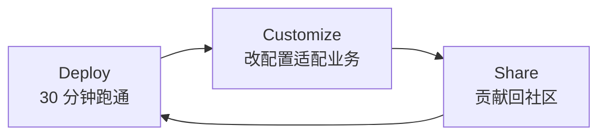

# Prax v0.4.0 — Enterprise Agent Template Library

**发布日期**: 2026-04-08  
**版本类型**: Major Pivot（重大定位升级）  
**Tag**: [`v0.4.0`](https://github.com/product-self-evolution/prax/releases/tag/v0.4.0)

---

## TL;DR

Prax 从"项目制 AI 学习平台"正式升级为 **"企业级 AI Agent 场景模板库"**。

从这个版本起，每个模板不再是"教你学会"的文档流程，而是**可 fork、可配置、可部署**的完整 Agent（基于 Dify，兼容 Coze / n8n）。

> 我们的目标：让有产品思维但非开发者的从业者，也能在 30 分钟内跑通第一个真正服务业务的 Agent。

---

## Why This Pivot

在 v0.3.x 之前，Prax 聚焦于"项目制学习"——教用户把一个 AI 项目做出来。

但反复讨论与用户访谈反馈告诉我们：

- 目标用户（PM、运营、业务分析师）**已经会用 AI 工具**，他们缺的不是"学"，而是"**可直接部署到业务**"的模板
- 开发者教程门槛过高、小白工具又停留在玩具 demo，中间层几乎空白
- 企业级 Agent 需要的是 **"配置即定制，不写代码"** 的可复用模板

v0.4.0 把 Prax 重新定位在这个中间层：**像 Next.js Starter 一样的企业 AI Agent 模板库**。

---

## Highlights

### 🎯 全新的产品定位

- **使命**: 降低企业 AI 落地的门槛，让有产品洞察但非开发者的从业者也能交付可运行、可复用、可维护的 Agent
- **愿景**: 成为"企业 AI Agent 的 Next.js Starter"
- **目标用户**: 在职 PM、运营、BA、半技术开发者（不再是"转型期待业者"）
- **核心原则**: 场景优先、低代码优先、配置即定制、可观测、可复用、文档即产品

详见 [`docs/vision.md`](docs/vision.md) 与 [`00-Problem-Statement.md`](00-Problem-Statement.md)（v2 版本）。

### 🔄 三阶段路线图重构

从 `Learn → Build → Share` 调整为 **`Deploy → Customize → Share`**：



- **Phase 1 Deploy (current)**: 3 个 MVP 模板（本版本）
- **Phase 2 Customize (9-16 weeks)**: 多源、多渠道、多场景预设
- **Phase 3 Share (17-24 weeks)**: 模板市场 + 企业案例集

详见 [`docs/roadmap.md`](docs/roadmap.md)。

### 📦 3 个模块全部重构为 Agent 模板形态

每个模块现在都具备企业级标准四件套：
`configs/` + `prompts/` + `workflow/` + `docs/`。

#### [`ai-digest`](modules/ai-digest/)
**RSS 多源聚合 → LLM 评分筛选 → LLM 摘要 → 邮件推送**

- 对应业务场景：行业情报岗、PM 每日资讯、分析师追踪
- 交付：`sources.sample.yaml`, `delivery.sample.yaml`, `scorer.prompt.md`, `summarizer.prompt.md`, Dify workflow 骨架, 30 分钟部署指南
- MVP 范围：3-5 个 RSS 源 + AI 评分 + 邮件单渠道

#### [`content-repurpose`](modules/content-repurpose/)
**单篇源内容 → 多平台适配草稿（小红书 / 微信公众号 / 视频脚本 / LinkedIn）**

- 对应业务场景：内容运营、独立创作者、品牌营销
- 设计原则：Human-in-the-Loop（产出草稿供人工审校后发布，MVP 不自动直发）
- 交付：`platforms.sample.yaml`, `rewriter.prompt.md`, 3 份平台样例草稿
- 与 `ai-digest` 可串联成"聚合 → 改写 → 分发"完整流水线

#### [`workflow-starter`](modules/workflow-starter/)
**通用 Agent 骨架，供派生新模板使用**

- 三段式设计：`Validate → Reason → Postprocess`
- 交付：`workflow.sample.yaml`, Dify 骨架, fork-guide.md
- 当你想做一个 Prax 里不存在的场景时，从这里 fork 比从空白画布快 10 倍

### 🛠 仓库与治理

- 根 `README.md` 全新对外叙事（企业 AI Agent 的 Next.js Starter）
- 明确平台策略：**Dify 主战场**，Coze / n8n / Ollama 兼容
- 发布流程脚本（`scripts/release-prax.sh`, `sync-prax-to-github.sh`）保持稳定
- MIT License（延续 v0.3.x）

---

## Breaking Changes

### 用户画像调整

- **之前**: 待业转型者、一人公司践行者、非技术背景的 AI 焦虑用户
- **现在**: 在职从业者（PM / 运营 / BA / 半技术开发者），企业场景需求

如果你是依据 v0.3.x 版本做二次开发，请 review 你的模块是否仍匹配新用户画像。

### 模块形态调整

v0.3.x 的模块 README 是 "prompt + 对话框"手动流程。
v0.4.0 起，所有模块都是 **可导入 Dify 的 workflow 模板**。

迁移建议：

- 如果你 fork 了 v0.3.x 模块，现在请参考新模块结构重新组织
- 或者直接在 v0.4.0 基础上派生

### 成功指标调整

- `TTV` / `FCR` / `WPR` / `PGR` → `DT` / `FDR` / `TDR` / `FR`
- 关注点从"学会率"转为"**部署率与复用率**"

---

## What's Next (Phase 1 收尾)

v0.4.0 是 Phase 1 MVP 骨架；下一步关键工作：

- [ ] 在 Dify 上按骨架搭建 `ai-digest` workflow，导出完整 DSL 替换当前 YAML 骨架
- [ ] 同上 `content-repurpose` 与 `workflow-starter`
- [ ] 邀请 3-5 位真实用户做首轮部署测试，收集 `DT`（部署时间）中位数
- [ ] 发布 `docs/testing/first-run-checklist.md`（企业用户测试脚本）
- [ ] 基于真实部署反馈发布 `v0.4.1` patch

---

## How to Get Started

### 快速路径（30 分钟跑通第一个 Agent）

```bash
git clone https://github.com/product-self-evolution/prax.git
cd prax

# 选一个模板
cd modules/ai-digest        # 信息聚合日报
# 或
cd modules/content-repurpose  # 内容多平台改写

# 按 docs/deployment.md 操作
cat docs/deployment.md
```

### 前置条件

- [Dify](https://dify.ai) 账号（Cloud 或本地 Docker 部署均可）
- LLM API Key（OpenAI / Anthropic / 国产模型任一）
- SMTP 账号（Gmail 应用密码 / 企业邮箱均可）

### 成本估算

- 每日日报（ai-digest）: 0.03 - 0.10 USD / day
- 单次内容改写 3 平台（content-repurpose）: 0.02 - 0.15 USD

---

## Contributing

Phase 1 欢迎以下贡献：

- 新模板提案（必须对应真实企业场景）
- 现有模板的可用性优化
- 多平台兼容（Coze / n8n 版本的 workflow）
- 部署指南的清晰度提升

详见 [`CONTRIBUTING.md`](CONTRIBUTING.md)。

---

## Full Changelog

**Commits**: [c0020a4..732ce0f](https://github.com/product-self-evolution/prax/compare/v0.3.1...v0.4.0)

**Primary changes**:

- `docs(strategy)`: 重写 Problem Statement / Vision / Roadmap 到新定位
- `feat(ai-digest)`: 改造为 Agent 模板（RSS + LLM 评分 + 邮件推送）
- `feat(content-repurpose)`: 改造为 Agent 模板（多平台改写 + 审校草稿）
- `feat(workflow-starter)`: 重新定位为通用 Agent 派生骨架
- `docs(readme)`: 升级对外叙事到"企业 AI Agent 模板库"
- `refactor(structure)`: 每模块增加 `configs/` / `prompts/` / `workflow/` / `docs/` 四件套

**Stats**: 27 files changed, 2357 insertions(+), 315 deletions(-)

---

## Credits

Prax v0.4.0 的产品定位升级基于对目标用户的深入讨论与复盘。

感谢所有参与早期构思的同行者。

**Prax**: Turning theory into practice, one Agent at a time.
