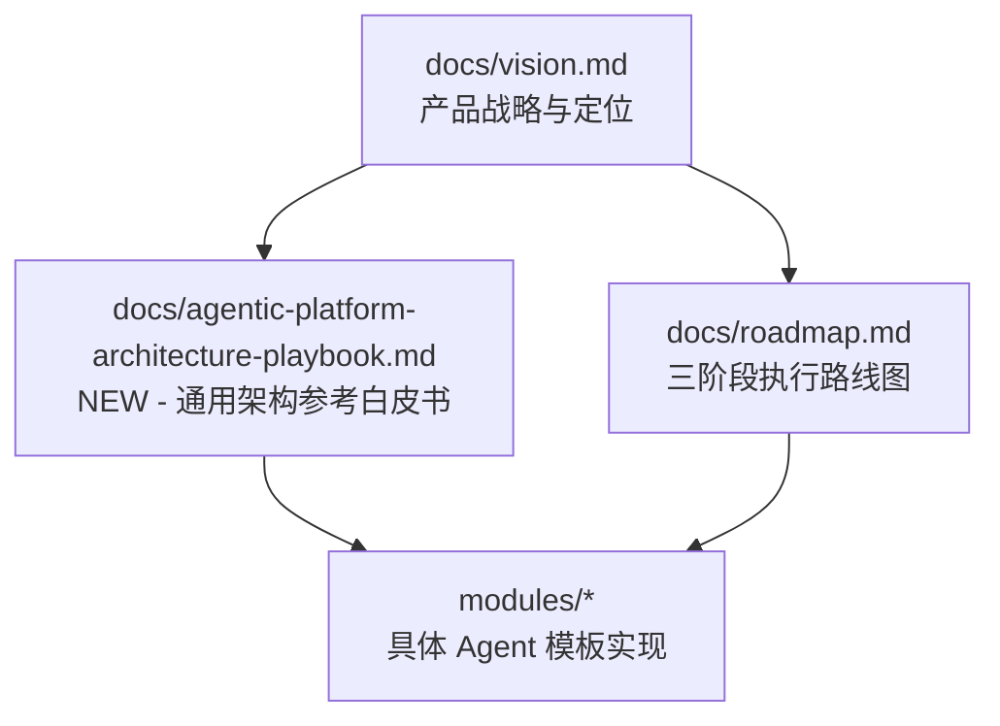

# Prax v0.5.0 — Agentic Platform Architecture Playbook

**发布日期**: 2026-04-08  
**版本类型**: MINOR（新增重量级参考白皮书）  
**Tag**: [`v0.5.0`](https://github.com/product-self-evolution/prax/releases/tag/v0.5.0)

---

## TL;DR

v0.5.0 新增一份 **1309 行、面向 PM 与技术读者的 Agentic 平台架构参考白皮书**：
[`docs/agentic-platform-architecture-playbook.md`](docs/agentic-platform-architecture-playbook.md)。

它补齐了 Prax 仓库"模板之外"的战略深度：**为什么类 Coze / Dify 的 Agentic 平台是这样设计的、企业 Agent 应该按什么顺序构建、落地过程中如何做治理和评估**。

> Prax 不只是模板库，更是关于"如何构建企业级 Agentic 系统"的方法论集合。

---

## Why This Doc Matters

v0.4.0 把 Prax 定位为"企业级 AI Agent 场景模板库"，但仅有模板不够。我们需要回答三类问题：

| 问题 | 读者 | 文档对应章节 |
|---|---|---|
| Agentic 平台到底是什么？和普通 Chatbot 有什么区别？ | PM / 决策者 | §0-§3 整体框架 |
| 平台内部是怎么运作的？关键模块是什么？ | 技术负责人 / 架构师 | §3-§5, §9-§10, §12, §15 |
| 我该怎么从 0 到 1 落地一个企业 Agent？ | PM / 实施团队 | §6-§8, §11, §13-§14 |

这份文档用**一份参考白皮书**统一回答这三类问题，让团队内部不需要反复解释"为什么我们这么做"。

---

## Highlights

### 📘 新增：Agentic Platform Architecture Playbook

**位置**: [`docs/agentic-platform-architecture-playbook.md`](docs/agentic-platform-architecture-playbook.md)

#### 核心结论（阅读前先看这 6 条）

1. **Agentic 平台不是一个会聊天的壳**，而是一个把目标、上下文、工具、状态、策略和治理组合起来的任务执行系统
2. 单个 Agent 的本质是一个**受约束的决策循环**：理解目标 → 计划 → 调用模型/工具 → 校验 → 更新状态 → 继续/结束
3. 类 Coze / Dify 平台真正提供的不是"大模型能力"，而是"把大模型变成**可配置、可调试、可上线能力**"的平台化基础设施
4. 编排有两种核心形态：**静态工作流编排**（高确定性任务）+ **动态 Agent 编排**（高不确定性任务），企业可落地的通常是二者混合的 **Hybrid Agentic Flow**
5. 平台化的关键不在"能跑通一个 Demo"，而在"**能稳定重复地跑通一类业务任务**"，治理/评估/权限/版本/审计/人工介入与模型本身同等重要
6. 从 0 到 1 的正确建设顺序：**先单场景 Agent → 再抽象 Flow 模板 → 最后沉淀平台能力**

#### 文档结构（16 章）

- `§0-§3` 整体框架与核心概念
- `§4-§5` 平台参考架构与运行时
- `§6-§8` 场景设计与落地路线
- `§9-§10` 工具、治理与状态管理
- `§11-§14` 业务接入、组织协同、产品策略
- `§15` 工程取舍与最佳实践
- `§16` 总结

#### 阅读路径建议

- **初次接触者**: §0 → §1 → §2 → §3
- **产品设计者**: §6 → §7 → §8 → §11 → §13 → §14
- **技术实施者**: §3 → §4 → §5 → §9 → §10 → §12 → §15

---

## What's Included in v0.5.0

### 新增文件

- `docs/agentic-platform-architecture-playbook.md` - 1309 行 Agentic 平台架构白皮书

### 无破坏性变更

- 所有 v0.4.0 的模板、配置、脚本保持不变
- 平台策略、模块结构、发布流程无变化

---

## Relation to Other Docs

- `vision.md`: **我们要做什么**（Prax 的产品边界）
- `roadmap.md`: **我们按什么顺序做**（Phase 1 / 2 / 3）
- `playbook.md`（新）: **这件事背后的通用方法论**（不限于 Prax）
- `modules/*`: **具体怎么做**（可运行模板）

三者互补，为读者提供"战略 → 方法 → 落地"的完整闭环。

---

## How to Read This Playbook

### 如果你是 PM / 决策者（30 分钟）

1. 先读 `§0 先给结论`
2. 再读 `§1 Agentic 平台到底是什么`
3. 最后读 `§13 产品策略 & 建设路线图`

### 如果你是架构师 / 技术负责人（60 分钟）

1. 先读 `§3 参考架构总览`
2. 再读 `§4-§5 平台核心模块`
3. 选读 `§10 状态管理` 与 `§12 评估体系`
4. 最后读 `§15 工程取舍与最佳实践`

### 如果你在落地一个具体 Agent（45 分钟）

1. 先读 `§6 Hybrid Agentic Flow`
2. 再读 `§7 从 0 到 1 的建设顺序`
3. 配合 Prax 的 `modules/workflow-starter/` 派生你自己的 Agent
4. 在过程中回看 `§11 业务接入模式` 做接入判断

---

## What's Next

- `v0.5.1` / `v0.5.2`: 基于读者反馈对 playbook 做局部优化
- `v0.6.0`（规划中）: Phase 1 完成标志 - 3 个模板全部通过真实部署验证
- `v0.7.0`（规划中）: 启动 Phase 2 Customize - 多源 + 多渠道扩展

---

## Full Changelog

**Commits**: [db2ae5a..HEAD](https://github.com/product-self-evolution/prax/compare/v0.4.0...v0.5.0)

**Primary changes**:

- `docs(playbook)`: 新增 Agentic 平台架构参考白皮书（1309 行）

---

**Prax**: Not just templates. A complete methodology for building enterprise Agents.
