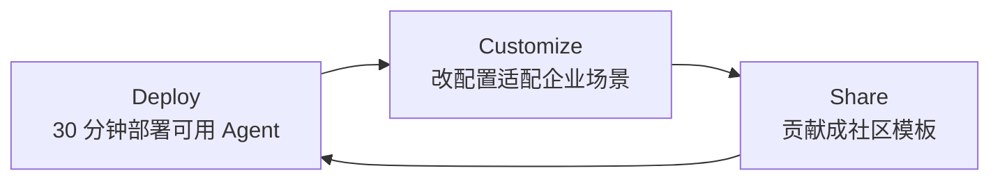

# Prax Vision

> **版本**: v2 (2026-04-08)
> **产品代号**: `Prax - Your Solo AI Forge`
> **定位升级**: 从"项目制 AI 学习"升级为"企业级 AI Agent 场景模板库"

---

## 1. 产品定义

Prax 是一个面向**在职从业者**的开源 AI Agent 场景模板库。

它把典型企业业务场景（信息聚合、内容生产、竞品追踪、客户反馈分析等）抽象为**可 fork、可配置、可部署**的低代码工作流模板。

用户不需要写代码，不需要研究框架，只需要：

1. 选择一个匹配你业务场景的模板
2. 导入到 Dify / Coze 等低代码平台
3. 改几个配置（数据源、推送渠道、触发条件）
4. 30 分钟内跑出一个真正服务业务的 Agent

Prax 的核心不是"教你学 Agent"，而是"让你直接拥有一个可运行的 Agent"。

## 2. 使命、愿景、北极星

### 2.1 使命 (Mission)

降低企业 AI 落地的门槛。让有产品洞察但非开发者的从业者，也能独立交付可运行、可复用、可维护的 Agent。

### 2.2 愿景 (Vision)

成为 **"企业 AI Agent 的 Next.js Starter"**：  
每一类典型业务场景都应该有一个官方 Prax 模板，就像 Web 开发有 Next.js Starter 一样。  
开发者、产品经理、运营都能 fork 它作为起点，在自己的业务里长出差异化价值。

### 2.3 北极星目标 (North Star)

从"我听说过 Agent 能做什么"迁移到"我 30 分钟内在公司场景里跑起了一个 Agent"。

---

## 3. 目标用户与核心场景

### 3.1 目标用户

| 用户类型 | 核心诉求 |
|---|---|
| 企业内产品经理（Product Manager, PM） | 寻找 AI 落地 PoC（Proof of Concept, 概念验证）方案 |
| 运营 / 增长 / 业务分析（BA） | 把信息聚合、内容生产、数据分析自动化 |
| 半技术背景开发者 | 走出"写脚本"，进入"系统化 Agent 交付" |
| 独立顾问 / 自由职业者 | 给客户交付可复用的 AI 能力包 |

### 3.2 高频场景

1. **信息聚合推送**：每日自动聚合竞品动态、行业资讯、技术更新
2. **内容批量改写**：把一篇长稿改写成多平台适配版本
3. **客户反馈分析**：邮件 / 工单 / 社媒舆情自动摘要与分类
4. **竞品追踪**：监控指定网站/公众号并摘要关键变化
5. **内部知识问答**：基于企业文档的 RAG（Retrieval-Augmented Generation, 检索增强生成）问答系统
6. **数据报告自动化**：定时拉取数据并生成结构化报告

## 4. 价值主张 (Value Proposition)

Prax 提供三重价值：

1. **Deploy**（部署）：从模板到 running 环境 <= 30 分钟
2. **Customize**（定制）：改配置即适配企业场景，无需改代码
3. **Share**（共享）：fork → 改造 → 回流成社区模板

这对应三层飞轮：

## 5. 产品原则

1. **场景优先**：每个模板都必须对应一个真实企业场景，不做玩具 demo
2. **低代码优先**：首选可通过 Dify / Coze 部署的模板，避免强制写代码
3. **配置即定制**：核心差异通过 `configs/*.yaml` 控制，不需要动工作流结构
4. **可观测性**：模板自带输入输出样例与日志示范，方便企业审计
5. **可复用优先**：每个模板必须能被 fork 并在 30 分钟内改造
6. **文档即产品**：README 与部署指南的质量就是产品本身的一部分

## 6. 产品边界

### 6.1 做什么

- 企业级 AI Agent 场景模板
- Dify / Coze 等低代码平台的 workflow 配置包
- 场景化部署指南（含环境准备、API Key 配置、调试手册）
- 模板间的组合与编排方法论

### 6.2 不做什么（当前阶段）

- 不做底层 Agent 框架（不与 LangChain / AutoGen 竞争）
- 不做模型训练或微调
- 不做通用 SaaS 产品（不跑托管服务）
- 不做玩具 demo（不接受"问天气"、"查日程"级别的模板）
- 不做视频课程或知识付费

## 7. 成功指标

### 7.1 核心指标

| 指标 | 定义 | 目标（Phase 1 MVP） |
|---|---|---|
| DT (Deploy Time) | 部署完成时间中位数 | <= 30 分钟 |
| FDR (First Deploy Rate) | 首次部署成功率 | >= 60% |
| TDR (Template Deploy Rate) | 模板被用户实际部署的比例 | >= 40% |
| FR (Fork Rate) | 模板的 fork 数（社区复用度） | >= 3 forks / 模板 |

### 7.2 传播指标

- 每模板平均 GitHub Star 增速
- 社区贡献 PR（Pull Request）数量与质量
- 企业案例集收录数（公开分享的落地案例）

## 8. 项目独立性

Prax 是一个完全独立维护的开源项目，具备独立的：

- 产品定位与路线图
- 仓库结构与治理规范
- 发布节奏与版本体系

Prax 不依赖任何外部知识库或上层项目命名语义，所有对外材料保持自洽、可直接开源分发。

## 9. 平台策略

### 9.1 主战场

**Dify**（开源、自托管、Agent + RAG + Workflow 完备）。  
原因：开源社区活跃、可自托管、对企业部署友好、workflow 可导出为 YAML 文件做版本管理。

### 9.2 兼容战场

- **Coze Studio（开源版）**：字节开源的 Agent 平台，中文用户熟悉度高，后续提供模板导出适配
- **n8n**：工作流编排为主，适合"纯流程编排 + 少量 AI"的模板
- **自托管 LLM（Ollama 等）**：可作为企业内网部署的后端模型

## 10. 12 个月愿景里程碑

- `M3`：发布 Phase 1 Deploy MVP（3 个企业级模板，含 Dify workflow）
- `M6`：完成 Phase 2 Customize（多源、多推送渠道、多场景预设）
- `M9`：启动 Phase 3 Share（社区模板市场 + 企业案例集）
- `M12`：形成"企业场景 → Agent 模板 → 复用与扩散"的自循环生态
