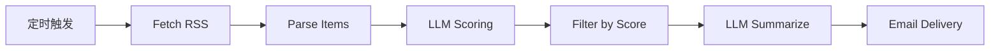

# ai-digest

> **类型**: Enterprise Agent Template
> **阶段**: Phase 1 Deploy MVP
> **主战场平台**: Dify（兼容 Coze / n8n）
> **预计部署时间**: <= 30 分钟

把你关注的 RSS 源交给一个 AI Agent，它会每天/每周自动筛选、摘要并推送到你的邮箱。你只需要改几行 YAML 配置。

## Business Scenario

**对应岗位**: 产品经理、行业分析师、运营、独立顾问  
**真实场景**:

- 我每天要追行业动态，但时间被业务占掉，只能靠碎片化浏览
- 公司内希望有一份统一的"AI 行业情报日报"发给团队
- 做内容创作/自媒体，需要一份结构化素材库供改写分发

`ai-digest` 把这些重复性的"采集 → 筛选 → 摘要 → 推送"动作交给 Agent 自动完成。

## Architecture



核心节点 7 个，全部在 Dify workflow 画布上可视化编排，无需写代码。

## Deliverables（本模块交付物）

| 文件 | 用途 |
|---|---|
| `configs/sources.sample.yaml` | RSS 源与过滤规则配置 |
| `configs/delivery.sample.yaml` | 调度与推送渠道配置 |
| `prompts/scorer.prompt.md` | LLM 评分节点 prompt |
| `prompts/summarizer.prompt.md` | LLM 摘要节点 prompt |
| `workflow/ai-digest.dify.yaml` | Dify workflow 结构骨架（规划） |
| `docs/deployment.md` | 30 分钟部署指南 |
| `output/digest.sample.md` | 最终产出样例 |

## Prerequisites

- Dify 账号（Cloud 或自托管，均可）
- LLM API Key（OpenAI / Anthropic / 兼容 API 任一）
- SMTP 账号（Gmail 应用密码 / 企业邮箱 / 阿里云邮件推送均可）
- 3-5 个你关注的 RSS 源 URL

成本估算（每日日报）: 0.03 - 0.10 USD / day

## Quick Start

完整步骤见 `docs/deployment.md`。速览：

1. `cp configs/sources.sample.yaml configs/sources.yaml`，填入你的 RSS 源
2. `cp configs/delivery.sample.yaml configs/delivery.yaml`，填入 SMTP 和收件人
3. 在 Dify 创建 Workflow App，按 `workflow/ai-digest.dify.yaml` 中的节点规划搭建
4. 把 `prompts/scorer.prompt.md` 和 `prompts/summarizer.prompt.md` 粘贴到对应 LLM 节点
5. 手动跑一次，验证邮箱收到 digest
6. 配置定时触发（daily 09:00 推荐）

## Configuration

### sources.yaml（你需要自定义的核心配置）

```yaml
settings:
  language: zh-CN
  max_items_per_source: 10
  lookback_hours: 24          # 日报 24 / 周报 168

sources:
  - id: anthropic-news
    type: rss
    url: https://www.anthropic.com/news/rss
    priority: high

filters:
  must_not_contain: [crypto, nft, meme]
  min_score: 6
```

### delivery.yaml（不要把密码明文提交）

```yaml
schedule:
  mode: daily
  time: "09:00"
  timezone: Asia/Shanghai

channels:
  - id: email-primary
    type: email
    enabled: true
    smtp:
      host: smtp.example.com
      port: 587
      username: your@example.com
      password_env: PRAX_SMTP_PASSWORD   # 从环境变量读取
      use_tls: true
    to: [you@example.com]
```

## Expected Output

参见 `output/digest.sample.md`。核心结构：

```markdown
# AI Digest - 2026-04-08

> 本期焦点: ...

## 🔥 Top News
（2-3 条高价值资讯）

## 🛠️ Tools & Updates

## 💡 Practical Takeaways

## 🎯 Next Actions
```

## Customization

本模板的"配置即定制"设计：

- **改行业**: 只改 `sources.yaml` 的 RSS 源即可（从 AI 改到电商、金融、医疗等）
- **改频率**: 改 `delivery.yaml` 的 `schedule.mode`（daily ↔ weekly）
- **改语气**: 改 `prompts/summarizer.prompt.md` 中的"写作原则"
- **改渠道**: 启用 `delivery.yaml` 中 Phase 2 预留的 Slack / Feishu 渠道

## Troubleshooting

常见问题与修复见 `docs/deployment.md` 的 "常见问题排查" 一节，包含：

- RSS 拉取 403/404
- LLM 评分返回非 JSON
- SMTP 认证失败
- digest 内容太泛

## DoD (Definition of Done)

部署完成当且仅当：

- [ ] workflow 在 Dify 成功导入并连线
- [ ] 手动执行一次，邮箱收到一份 digest
- [ ] 定时触发配置完成
- [ ] 次日 09:00 自动收到 digest
- [ ] 内容结构与 `output/digest.sample.md` 一致

完成以上 5 条 → 你已拥有一个**每天自动服务你业务的企业级 AI Agent**。

## Roadmap of this Module

- **v0.4.0 (Phase 1 MVP)**: RSS + LLM 筛选摘要 + 邮件单渠道
- **v0.5.0 (Phase 2)**: 多源（RSS + Newsletter 邮件 + 网页抓取）
- **v0.6.0 (Phase 2)**: 多渠道推送（Slack / 飞书 / 企业微信）
- **v0.7.0 (Phase 2)**: 场景预设（PM 版 / 运营版 / 分析师版）
- **v1.0.0 (Phase 3)**: 进入社区模板市场，接受外部贡献
