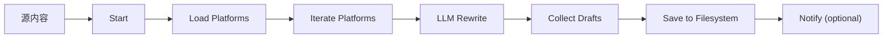

# content-repurpose

> **类型**: Enterprise Agent Template
> **阶段**: Phase 1 Deploy MVP
> **主战场平台**: Dify
> **预计部署时间**: <= 30 分钟

把一篇源内容自动改写为多平台适配草稿（小红书 / 微信公众号 / 视频脚本 / LinkedIn 等），产出"可审校草稿"供人工 review 后发布。

## Business Scenario

**对应岗位**: 内容运营、品牌营销、独立创作者、自由顾问  
**真实场景**:

- 我写了一篇深度文章，需要同时发布到 3-5 个平台，每个平台风格不同，每次手动改写 3 小时
- 我的 ai-digest 产出了一份日报，想改成公众号文章、朋友圈、小红书
- 公司要求统一输出"多渠道内容包"，需要规模化、风格一致、可复用

`content-repurpose` 把改写工作交给 Agent，同时保留"人在回路"审校环节，产出企业可直接发布的草稿。

## Design Principle: Human-in-the-Loop

内容类 Agent 不同于聚合类 Agent。内容需要**人工审校**后再发布（避免事实错误、风格偏移、合规风险）。因此：

- MVP 阶段 **不自动发布**到任何平台
- Agent 只生成草稿到 `output/drafts/`
- 可选通知渠道：告知"草稿已生成"，但不附带内容正文
- 发布动作由人类完成（复制、微调、上传）

Phase 2 会提供可选的"直连发布"插件（小红书 Open API 等），但仍建议保留人工审校步骤。

## Architecture



核心 7 个节点，全部在 Dify workflow 上可视化。

## Deliverables

| 文件 | 用途 |
|---|---|
| `configs/platforms.sample.yaml` | 平台与约束配置（字数、语气、格式） |
| `configs/delivery.sample.yaml` | 输出位置与通知配置 |
| `prompts/rewriter.prompt.md` | LLM 改写节点的 prompt |
| `workflow/content-repurpose.dify.yaml` | Dify workflow 骨架 |
| `docs/deployment.md` | 30 分钟部署指南 |
| `input/source.sample.md` | 源内容示例 |
| `output/*.sample.md` | 三平台草稿样例（xiaohongshu / wechat-article / video-script） |

## Prerequisites

- Dify 账号（Cloud 或自托管）
- LLM API Key（推荐 Claude Sonnet 级别或 GPT-4，对 tone 区分更敏感）
- 一篇可用于测试的源内容（Markdown 格式）

## Quick Start

完整步骤见 `docs/deployment.md`。速览：

1. `cp configs/platforms.sample.yaml configs/platforms.yaml`，保留你需要的平台
2. `cp configs/delivery.sample.yaml configs/delivery.yaml`，配置输出位置
3. 在 Dify 按 `workflow/content-repurpose.dify.yaml` 骨架搭建
4. 把 `prompts/rewriter.prompt.md` 粘贴到 LLM 节点
5. 用 `input/source.sample.md` 做一次测试
6. 检查 `output/drafts/` 看是否符合样例

## Configuration

### platforms.yaml（核心自定义）

启用/关闭平台，调整字数、语气、AI hints：

```yaml
platforms:
  - id: xiaohongshu
    enabled: true
    constraints:
      max_chars: 1000
      tone: "friendly, trend-aware, visual-first"
      hashtag_count: [3, 8]
    ai_hints:
      - 开头用钩子句抓眼球
      - emoji 分段避免长段落
      - 结尾引导评论或收藏
```

### delivery.yaml（输出与通知）

```yaml
output:
  directory: ./output/drafts
  filename_template: "{platform}-{date}-{slug}.md"
notifications:
  - id: feishu-notify
    enabled: false   # 默认关闭
```

## Expected Output

看 `output/` 目录下的 3 份 sample：

- `xiaohongshu.sample.md` - 小红书风格（emoji + 钩子 + hashtag）
- `wechat-article.sample.md` - 公众号结构化长文
- `video-script.sample.md` - 4 分钟口播脚本（含时间戳）

每份草稿顶部带 `frontmatter` 标识 platform、字数、状态，方便后续自动化处理。

## Customization

| 场景 | 改哪里 |
|---|---|
| 换语气（活泼 ↔ 保守） | `platforms.yaml` 的 `tone` 字段 |
| 加新平台（如即刻、X） | `platforms.yaml` 增加一条，在 prompt 中补充特化策略 |
| 输出英文版 | 设置 `settings.output_language: en-US` |
| 与 ai-digest 串联 | Dify 主 workflow 顺序调用两个子 workflow |

## DoD (Definition of Done)

- [ ] workflow 在 Dify 导入并连线
- [ ] 用 sample input 跑通，生成 3 份草稿
- [ ] 草稿符合各平台字数/格式约束
- [ ] 草稿事实准确（无虚构内容）
- [ ] 整个流程可复现给团队其他成员

## Roadmap of this Module

- **v0.4.0 (Phase 1 MVP)**: 源内容 → 多平台草稿（3-4 平台）
- **v0.5.0 (Phase 2)**: 新增平台（即刻、X/Twitter、知乎）
- **v0.6.0 (Phase 2)**: 多 LLM 策略（不同平台用不同模型）
- **v0.7.0 (Phase 2)**: 直连发布适配器（小红书 Open API 等，仍保留审校开关）
- **v1.0.0 (Phase 3)**: 进入社区模板市场
