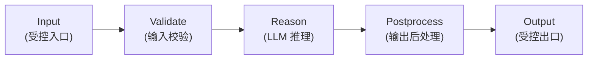

# workflow-starter

> **类型**: Universal Agent Skeleton（非业务模板，供派生使用）
> **阶段**: Phase 1
> **主战场平台**: Dify
> **使用方式**: fork 这个模块作为你自己新 Agent 的起点

`workflow-starter` 不是某个具体业务场景的 Agent，而是一个**通用的 Agent 模板骨架**。

当你想在 Dify 上构建一个 Prax 里还不存在的 Agent 时（例如"客户反馈分析"、"竞品追踪"、"合同审查"），从这个骨架派生比从空白画布开始快 10 倍。

## Why This Module Exists

没有这个模块会发生什么：

- 每个新 Agent 都要从头设计节点结构
- 不同人做的 Agent 结构不一致，难以维护
- 新手在 Dify 里面对空白画布不知所措
- Prax 社区贡献的模板质量参差

有这个模块会发生什么：

- 所有新 Agent 共享 "三段式"（Validate / Reason / Postprocess）结构
- 贡献者按同一套骨架扩展，便于 code review
- 新手有明确起点，降低入门门槛
- 模板生态保持一致性

## The "Three-Segment" Design



**为什么是这三段**:

- **Validate**: 保证垃圾数据不进入昂贵的 LLM 调用（省钱 + 防注入）
- **Reason**: 单一 LLM 节点负责业务推理（清晰职责 + 易替换模型）
- **Postprocess**: 结构化、裁剪、合规过滤（输出质量保障）

复杂场景会在这三段基础上**插入额外节点**（如 retrieval / scoring / iteration），但骨架始终保留。

## Deliverables

| 文件 | 用途 |
|---|---|
| `configs/workflow.sample.yaml` | Agent 元信息与管道定义模板 |
| `workflow/workflow-starter.dify.yaml` | Dify 骨架 workflow（可导入） |
| `docs/fork-guide.md` | 5 步派生新 Agent 的指南 + 常见节点组合 |

## Quick Start (Derive a New Agent)

```bash
# 1. 复制
cp -r modules/workflow-starter modules/my-new-agent
cd modules/my-new-agent

# 2. 改配置
vim configs/workflow.yaml     # 修改 agent.id / name / description / input

# 3. 写业务 prompt
mkdir -p prompts
vim prompts/main.prompt.md    # 定义 Agent 的业务逻辑

# 4. 在 Dify 搭建
# 复制 workflow/workflow-starter.dify.yaml 为 workflow/my-new-agent.dify.yaml
# 按骨架在 Dify 画布连线
# 把 main.prompt.md 粘贴到 LLM 节点

# 5. 写 README 描述业务场景
vim README.md
```

完整步骤见 `docs/fork-guide.md`。

## When to Use / When NOT to Use

### ✅ 适合用 workflow-starter

- 有明确业务场景但缺起点
- 想在 Prax 生态里规范地贡献一个新 Agent
- 需要学习 Dify workflow 的标准结构

### ❌ 不适合用 workflow-starter

- 已经有对应的具体模板（如 ai-digest、content-repurpose）→ 直接 fork 那个模板
- 只是想做一个纯 Chatbot → 用 Dify 的 Chatflow 类型
- 需要多 Agent 协作编排 → 等待 Phase 2 的 `multi-agent-starter` 模块

## Common Node Compositions (For Reference)

### A. 简单生成型

```
Start → Validate → Reason (LLM) → Postprocess → End
```

### B. RAG 检索增强型

```
Start → Validate → Retrieve → Reason (LLM) → Postprocess → End
```

### C. 评分筛选型（类似 ai-digest）

```
Start → Fetch → Parse → Iterate → Score (LLM) → Filter → Summarize (LLM) → Deliver → End
```

### D. ReAct 多步推理型

```
Start → Plan (LLM) → Iterate Tools → Reflect (LLM) → End
```

详细说明见 `docs/fork-guide.md`。

## DoD (Using This Starter)

使用 workflow-starter 派生新 Agent 视为完成当且仅当：

- [ ] 你的新 Agent 有独立的 `modules/<your-agent>/` 目录
- [ ] `configs/workflow.yaml` 的 agent 元信息完整
- [ ] `prompts/` 下有至少一份业务 prompt
- [ ] `workflow/` 下有可导入的 Dify YAML
- [ ] README.md 描述了清晰的业务场景
- [ ] 保留了 Validate / Reason / Postprocess 三段式结构

## Contributing Back

你基于 workflow-starter 做的 Agent，如果通用性高，可以贡献回 Prax 主仓库。审核标准见 `docs/fork-guide.md` 最后一节。
